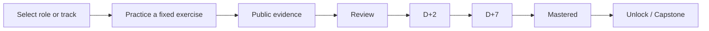

# LLM Interview Lab

[简体中文（规范版本）](README.md) | English

> English translation of the current candidate documentation. The Chinese documentation is canonical when wording differs. Candidate changes are not part of the published Alpha.3 release.

A local-first, role-aware, AI-assisted interview workbench. It combines role skill maps, structured mock interviews, tested coding exercises, oral review, and spaced retention so that “I understand it” can become “I can implement and explain it independently.”

[](https://github.com/ComistryMo/llm_interview_lab/actions/workflows/ci.yml)
[](https://github.com/ComistryMo/llm_interview_lab/releases)
[](pyproject.toml)
[](LICENSE)
[](#status)

[Download](#download) · [CLI quick start](#cli-quick-start) · [Connect AI](#optional-ai-connections)


**Role-aware paths · Tested exercises · AI interviews · Evidence review · Retention**

Current source has an interview-first home, a collapsible sidebar, complete Chinese task statements and local oral-draft recovery. New dynamic interviews use role, authorized background and difficulty, not intern/new-grad/experience tiers. Answers are saved before streaming the next question; grading happens after the interview. Invalid coding IDs are rejected, not silently replaced. The shared native editor separates running a script from public tests. See the [candidate evidence and live-test limits](docs/desktop-candidate-20260909-report.zh.md) and [production Before/After screenshots](docs/design/desktop-candidate-20260909.zh.md). Older release screenshots remain historical; public downloads were not replaced.

This is not a random question list, a one-pass mastery badge, or a way for AI to silently write a learner's answer. Local practice requires no AI connection; personalized interviews do.

## What it includes

- A private local Profile for career materials, submissions, interview records, and progress.
- Eight public Role Profiles for product, applied AI, agents, algorithms, post-training, infrastructure, inference, and evaluation/safety.
- A deterministic curriculum DAG, recommended Quests, and integration Capstones.
- Timed, structured mock interviews with evidence-backed scorecards.
- Public tests, contract review, oral defense, and D+2 / D+7 retention.
- Optional OpenAI-compatible, Ollama, and Codex connections with Context Preview and system-keyring credentials.

## Download

The isolated `candidate/desktop-release-20260909` branch uses source version `0.4.0a4`; `v0.4.0-alpha.4` is **not published**. Candidate packages and platform gates are documented in the report above. `main` and existing releases have not been overwritten. The existing [Alpha.3 Release](https://github.com/ComistryMo/llm_interview_lab/releases/tag/v0.4.0-alpha.3) does not include these candidate changes.

All 96 ready problem assets are included. The Windows candidate without PyTorch has 27 runtime-eligible validated coding problems, not the development environment's 84. Planned nodes and missing dependencies are not counted as runnable practice. See the [coverage definitions](docs/content/release-candidate-coverage-20260909.zh.md) and [same-host performance measurements](docs/performance/desktop-candidate-20260909.zh.md).

| User | Artifact |
|---|---|
| Windows 10/11 x64 | `LLMInterviewLab-Windows-x64-portable.zip` |
| Apple Silicon Mac, macOS 12+ | `LLMInterviewLab-macOS-arm64.dmg` |
| Apple Silicon automation/direct extraction | `LLMInterviewLab-macOS-arm64.app.zip` |
| Intel Mac | No verified x86_64 artifact |
| Developer or contributor | Source installation below |

The Alpha.3 macOS build is ad-hoc signed, not signed with an Apple Developer ID, and not notarized. Verify `SHA256SUMS.txt`; see the canonical [macOS guide](docs/macos.md). The Windows build is also unsigned; see the [Windows guide](docs/windows.md).

The Alpha.3 desktop release uses the following first-launch flow:

```text
Open the app
→ Create a Profile
→ Select a target role
→ Keep No AI, or connect AI
→ Start training
```

## CLI quick start

```bash
git clone https://github.com/ComistryMo/llm_interview_lab.git
cd llm_interview_lab
python -m venv .venv
```

Activate `.venv` (`.venv\Scripts\Activate.ps1` on PowerShell or `. .venv/bin/activate` on macOS/Linux), then:

```bash
python -m pip install -e ".[dev]"
llm-lab init --profile default --track ai_foundation
llm-lab doctor
llm-lab next --profile default
llm-lab start FND-001 --profile default
llm-lab test FND-001 --profile default
```

The public starter is expected to fail until you implement it. PyTorch exercises use `python -m pip install -e ".[torch,dev]"`; the full desktop source build uses `.[desktop,ai,dev]`.

## Learning and interviews



**Public tests passed does not mean mastered.** AI cannot create objective test results or grant mastery. Mock-interview scores remain separate from Practice evidence.

### Research-backed interview knowledge

The repository also ships a read-only knowledge layer. `eight_stock` cards
contain equations, shapes, debugging prompts, and follow-ups;
`experience_pattern` cards are scoped, confidence-labelled observations from
public reports; and `coding_prompt` cards are original implementation
contracts linked to Catalog problems (ready problems are runnable, while
planned links are explicit future-practice pointers). They do not change the Grader,
Practice events, or mastery state.

```bash
llm-lab knowledge list --kind eight_stock --priority P0 --limit 20
llm-lab knowledge search "GRPO reward" --track post_training
llm-lab knowledge show COD-PT-001
llm-lab knowledge validate --with-catalog
llm-lab doctor --knowledge
```

The bundle follows a clean-room link-and-paraphrase policy: papers and
official documentation support technical claims, while public interview
reports provide scoped question-pattern signals only. See the
[source registry](references/interview-sources.json) and
[research/refresh policy](docs/interview-content-research.md).

## Optional AI connections

Choose one of three modes:

- **No AI:** local curriculum, grader and retention remain available; the desktop personalized interview page requires an AI connection.
- **Chat provider:** OpenAI, OpenAI-compatible endpoints, and Ollama are the packaged Alpha path. The source package also includes native Anthropic and Gemini adapters.
- **Codex:** official App Server integration for repository context, test execution, streamed events, diffs, and explicit approvals. It does not scrape terminal ANSI output.

Only fields selected in Context Preview are sent. API keys are stored in Windows Credential Manager or macOS Keychain and are never written to Profile YAML or events. Do not upload an entire Profile or confidential employer material.

## Data and privacy

- Source/CLI mode uses repository-local `workspace/profiles/<id>/`, ignored by Git.
- Packaged Windows uses `%LOCALAPPDATA%\LLM Interview Lab\`.
- Packaged macOS uses `~/Library/Application Support/LLM Interview Lab/`.
- The project has no account, cloud sync, or automatic telemetry.
- The local grader executes code you trust; it is not a hostile-code security sandbox.

## Status

See the canonical [Chinese README](README.md#项目状态) for current Catalog counts. The version marker remains `v0.4.0-alpha.3`; the existing desktop downloads have not been rebuilt with these source changes. This iteration deepens 16 knowledge cards and 12 existing coding exercises, without presenting automated validation as human field testing.

New original exercises cover Nesterov SGD, label-smoothed cross entropy, causal/padding masks, and GSPO sequence ratios. They require PyTorch and have Chinese task descriptions, public tests, and independent numerical validation. Their own D+2/D+7 variants are not available yet, so passing these exercises cannot grant mastery. See the [Chinese source README](README.md#ai-手撕题当前源码) for details.

This is an Alpha prerelease. Provider behavior varies by upstream service, Apple Developer ID signing/notarization is not configured, and no real Field Run is claimed.

## Contributing and support

- Start with [CONTRIBUTING.md](CONTRIBUTING.md).
- Report reproducible bugs through [GitHub Issues](https://github.com/ComistryMo/llm_interview_lab/issues).
- Report vulnerabilities privately according to [SECURITY.md](SECURITY.md).
- Detailed user documentation is Chinese-first under [`docs/`](docs/desktop-app.md).

The project is licensed under [Apache License 2.0](LICENSE).
