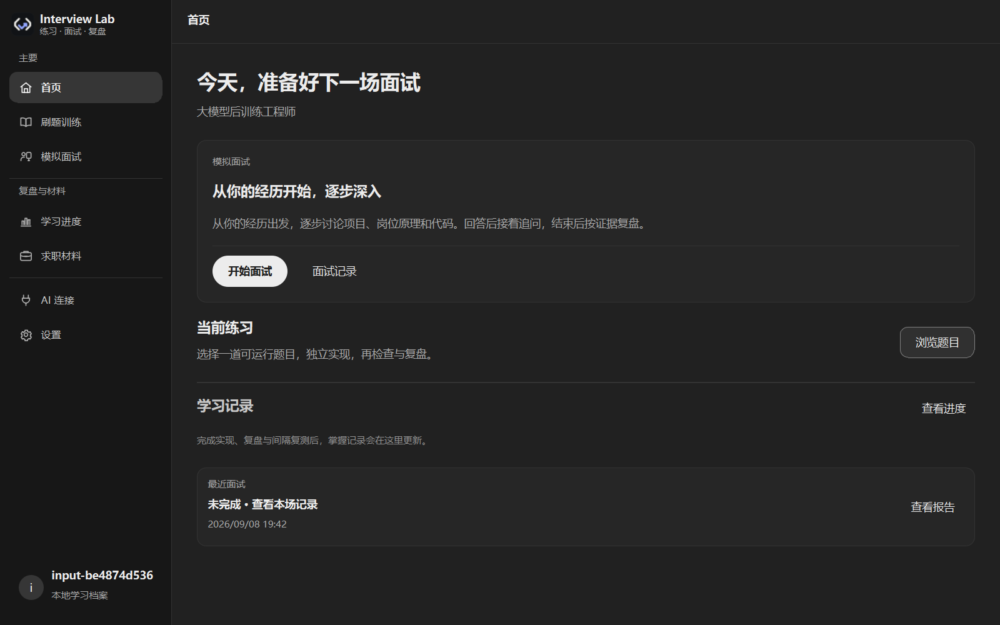
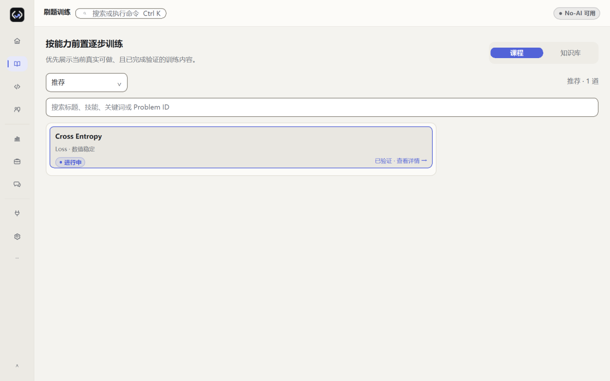
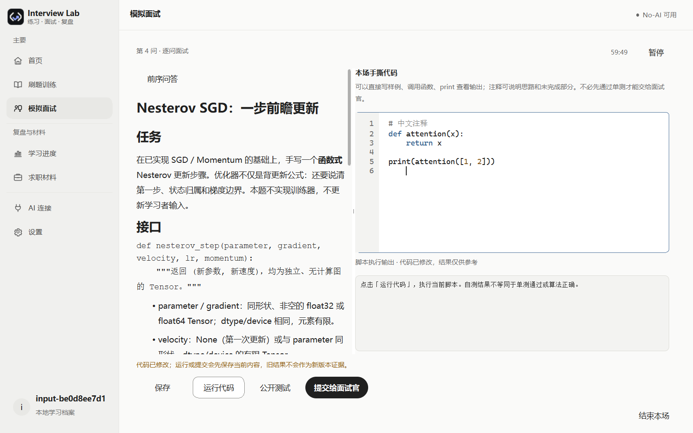
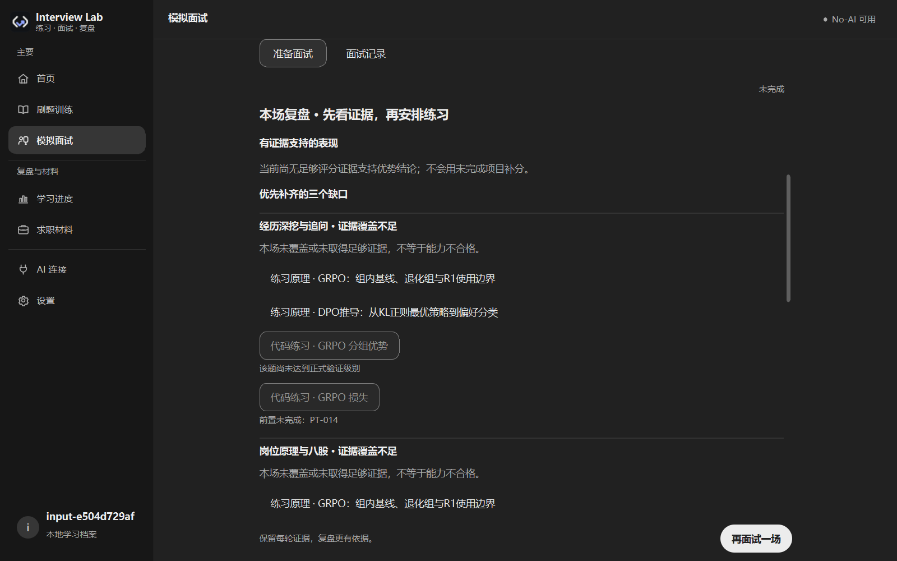
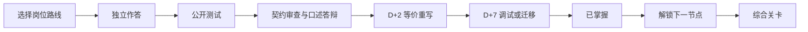

<p align="center">
  
</p>

# LLM Interview Lab

[简体中文](README.md) | [English](README.en.md)

> 一个本地优先、岗位感知、AI 辅助的 AI 面试训练工作台：用岗位技能图谱、固定课程、结构化模拟面试、代码测试与间隔复测，把“看懂”变成“能独立实现和解释”。

[](https://github.com/ComistryMo/llm_interview_lab/actions/workflows/ci.yml)
[](https://github.com/ComistryMo/llm_interview_lab/releases)
[](pyproject.toml)
[](LICENSE)
[](#项目状态)

[**下载桌面应用**](#下载与三分钟开始) ·
[**三分钟开始（Start in 5 Minutes）**](#下载与三分钟开始) ·
[**浏览课程（Browse Curriculum）**](#如何开始训练) ·
[**连接 AI（Use with AI）**](#如何接入-ai)



当前源码的正式页面，使用隔离合成档案；[深浅主题与源码证据](docs/images/unified-interview-20260908/manifest.json)。新面试取消求职阶段分档，提交后优先逐问生成、结束再评分；[本轮实现与真实传输限制](plans/active/unified-difficulty-interview-workbench.zh.md)。旧安装包可参考[历史首页截图](docs/images/desktop-home.png)，未随本轮源码重新发布。

**岗位路线 · 经过测试的练习 · AI 模拟面试 · 证据复盘 · 间隔复测**

这不是随机题单，不是一次测试通过就宣布掌握，也不是让 AI 代写答案。
你可以只刷题，也可以结合自己的脱敏求职材料进行针对性模拟面试；不用连接 AI 也能完整使用确定性的本地功能。

## 这是什么项目

LLM Interview Lab 把三个入口放进同一个本地学习档案（Profile）：

- **求职材料：** 保存简历、求职意向、项目、论文、比赛、岗位 JD 与真实面试问题；只有逐场明确授权的材料才可进入 AI 上下文。
- **刷题训练：** 固定题目按硬依赖组成 DAG，闯关路线（Quest）提供推荐顺序，综合关卡（Capstone）验证组合能力。
- **模拟面试：** 岗位决定方向，获准简历/JD决定切入点，简单/标准/困难决定深度与广度，不按实习、校招或年限分档。自我介绍后逐问深挖、原理、手撕；下一问流式显示，结束后台评分并将缺口链接到实际练习。

核心设计：

- 硬依赖、测试、计时、解锁和掌握状态由确定性代码计算。
- 公开测试通过只是实现证据；契约审查、口述答辩和 D+2 / D+7 间隔复测共同组成掌握条件。
- 桌面 AI 只用于面试追问与证据评价，不代写练习、不自行授予“已掌握”；旧 CLI 教练协议保留兼容。
- 真实答案、材料、面试记录和连接配置默认保存在本机，并被 Git 忽略。

## 适合哪些 AI 岗位

第一版提供八类公共岗位画像。岗位 Alias 复用同一技能图谱，不复制课程：

| 岗位 | 典型面试重点 |
|---|---|
| AI 产品经理 | 问题定义、指标、评测、安全、成本与交付 |
| AI 应用工程师 | LLM API、RAG、Tool Calling、可靠性与评测 |
| AI Agent 工程师 | Tool、Parser、Executor、State、Trajectory 与恢复 |
| AI 算法 / 研究工程师 | 数学、PyTorch、Transformer / VLM 与实验设计 |
| 大模型后训练工程师 | SFT、Preference、Reward、DPO、PPO / GRPO |
| AI Infra / ML 平台工程师 | 数据与训练平台、分布式、Checkpoint 与可观测性 |
| AI 推理 / 系统工程师 | KV Cache、Serving、量化、Kernel 与性能分析 |
| AI 评测 / 数据 / 安全工程师 | 数据质量、Rubric、污染检测、安全与统计分析 |

详见[岗位画像与面试蓝图](docs/role-profiles.md)。

## 下载与三分钟开始

本轮更新的是 **`main` 源码**，包版本标记仍为 `0.4.0a3`，没有重新构建或发布安装包。下方 [Alpha.3 Release](https://github.com/ComistryMo/llm_interview_lab/releases/tag/v0.4.0-alpha.3) 属于既有发布，不包含本轮统一难度工作台；验收本轮改动请使用源码安装。

| 你使用的环境 | 推荐方式 |
|---|---|
| Windows 10 / 11 x64 | 下载 `LLMInterviewLab-Windows-x64-portable.zip`，完整解压后运行 |
| Apple Silicon Mac（M1 及更新） | 下载 `LLMInterviewLab-macOS-arm64.dmg` |
| 需要直接解压验证的 Apple Silicon Mac | 下载 `LLMInterviewLab-macOS-arm64.app.zip` |
| Intel Mac | 本版没有经过验证的 x86_64 包 |
| 开发者或贡献者 | 源码安装 |
| 不希望连接 AI | 首次启动选择“暂不连接 AI” |

[下载 Alpha.3 桌面版](https://github.com/ComistryMo/llm_interview_lab/releases/tag/v0.4.0-alpha.3) · [浏览当前 `main` 源码](https://github.com/ComistryMo/llm_interview_lab/tree/main) · [校验 SHA-256](https://github.com/ComistryMo/llm_interview_lab/releases/download/v0.4.0-alpha.3/SHA256SUMS.txt)

Alpha.3 的首次启动流程如下：

```text
打开应用
→ 创建学习档案
→ 选择目标岗位
→ 直接开始（默认使用 No-AI；AI 可稍后在设置中连接）
→ 点击“开始训练”
```

普通桌面用户不需要打开终端、编辑 YAML、记 Problem ID 或理解事件 Schema。
Windows 细节见 [Windows 指南](docs/windows.md)，macOS 细节见 [macOS 指南](docs/macos.md)。

### 源码安装

Python 3.11 是推荐版本；核心 CLI 支持 Python 3.10–3.12。

```bash
git clone https://github.com/ComistryMo/llm_interview_lab.git
cd llm_interview_lab
python -m venv .venv
```

激活环境：

```powershell
# Windows PowerShell
.venv\Scripts\Activate.ps1
```

```bash
# macOS / Linux
. .venv/bin/activate
```

安装并启动：

```bash
python -m pip install -e ".[desktop,ai,dev]"
llm-lab-gui
```

只使用 CLI：

```bash
python -m pip install -e ".[dev]"
llm-lab init --profile default --track ai_foundation
llm-lab doctor
llm-lab next --profile default
llm-lab start FND-001 --profile default
llm-lab test FND-001 --profile default
```

公开 starter 预期会失败：它只定义接口，不包含答案。根据 `start` 输出编辑当前 `submission.py`，再运行同一条测试命令。
PyTorch 题使用：

```bash
python -m pip install -e ".[torch,dev]"
```

也可以让 CLI 只询问最必要的首次选择：

```bash
llm-lab quickstart
```

## GUI 使用流程

首次启动只需两步：创建学习档案、选择岗位。应用默认 **No-AI**；能力自评和 AI 连接可以稍后补充。无需填写求职阶段，本地刷题不依赖 AI。


当前源码首页突出“继续面试 / 开始面试”，下方展示当前练习、最近记录和复盘建议。准备页记住上次岗位、难度、时长和 AI 配置；材料仍需逐场授权。此布局尚未打包到旧 Release。

<details>
<summary>查看答题、面试和 AI 连接界面</summary>

训练页只保留真实有效的“推荐 / 已解锁待练 / 实验性 / 搜索”，并在进入题目前显示当前环境和进行中任务的阻断原因。



当前 Practice/Interview 共用原生轻量编辑器：行号、Python 高亮、缩进、撤销重做与保存状态。宽屏题面/代码并排，小窗口切换不丢代码。运行自己的 Python 样例与公开测试是不同动作。独立 AI 辅助页和常驻答题工作区导航已移除，真实作答仍从训练、当前任务或报告进入。



模拟面试一次生成一问，可回看已发生的问答。计时包含阅读和作答，排除 AI 等待；结束先看优势、覆盖缺口与练习动作，再看评分。16 张原理卡深化追问路径，12 道现有手撕补充中文说明、边界和核心逻辑评价，不修改固定测试制造通过。



AI 连接页面默认强调无需 AI 的本地模式。远程服务发送前必须经过上下文预览；Codex 写操作显示审批卡片与 Diff。


</details>

## 如何开始训练



> **公开测试通过 ≠ 已掌握。**

刷题状态依次为 `not_started → in_progress → implemented → reviewed → retained_d2 → retained_d7 → mastered`。
没有经过验证的复测资产时，系统会明确阻止进入 `mastered`，不会降低标准。

默认 Planner 只推荐 `oracle`、`field` 或 `stable` 节点。仅达到 `contract` 的实验题仍可在完整 Catalog 中查看，但需要主动开启实验题。

```bash
llm-lab catalog
llm-lab graph --track ai_foundation
llm-lab graph --quest tensor_and_autograd
```

当前连续可走通的 Golden Quest：

| 闯关路线 | 必修题 | 综合关卡 | 当前验证 |
|---|---:|---|---|
| Python Data Reliability | 6 | Hard Sample Data Pipeline | Oracle + D+2 / D+7 |
| Tensor & Stable Loss | 9 | Masked Sequence Classification Loss | Oracle + D+2 / D+7 |
| Optimizer & Training Loop | 6 | Tiny Sequence Classifier Trainer | Oracle + D+2 / D+7 |

### AI 手撕题（当前源码）

2026-09-08 的 [AI 算法手撕 40 项专项](docs/content/ai-handwriting-40.zh.md) 已接入当前源码：21 个规划节点补齐、18 个不同接口/进阶节点新增，AdamW 复用原题。包括完整 MHA/GQA Cache、RoPE、SFT/DPO/GRPO/PPO/GAE、LoRA、MoE、Decoder、手写反传、传统 ML、视觉与排序评测；配套 40 张技术卡、17 张注明证据范围的面经模式和五条推荐路线。新增节点通过公开及私有验证；尚无独立复测包的题不能标为 mastered。没有 PyTorch 时可选择符合当前环境的 NumPy/标准库题，不代表能运行全部专项。

已有 [SGD](curriculum/problems/OPT-001-sgd/task.md)、[交叉熵](curriculum/problems/LOSS-014-cross-entropy/task.md)、[MHA](curriculum/problems/ATT-004-multi-head-attention/task.md)、[GRPO Clipped Loss](curriculum/problems/PT-015-grpo-loss/task.md)；前一轮补充的相邻能力仍保留原接口：

| 新题 | 重点 |
|---|---|
| [OPT-003 · Nesterov SGD](curriculum/problems/OPT-003-nesterov-momentum/task.md) | 第一步、多步动量、状态归属与梯度边界 |
| [LOSS-002 · 标签平滑交叉熵](curriculum/problems/LOSS-002-label-smoothing/task.md) | 稳定计算、ignore index、全忽略时的可导零 |
| [ATT-003 · 因果与填充掩码](curriculum/problems/ATT-003-causal-padding-mask/task.md) | MHA 可见性、绝对位置、增量解码和 padding |
| [PT-019 · GSPO 序列比率](curriculum/problems/PT-019-gspo-sequence-ratio/task.md) | 几何比率、序列级裁剪、长短回答权重 |

四题均有中文完整题面、公开测试、口述追问和独立数值验证，需要 PyTorch。按已掌握的前置解锁；新模拟面试另按岗位、所选难度及环境选题。**四题自身尚无 D+2/D+7，因此可以实现、测试和复盘，但不能宣称已掌握。** 不代表旧安装包已有这些内容。

## 如何进行模拟面试

1. 确认上次设置，或选择岗位、难度、时长和面试官；首次默认标准、60 分钟，无求职阶段分档。
2. 可选已脱敏的简历和 JD / 补充材料；文本型 PDF / DOCX 在本地生成 SHA-绑定的只读文本快照，应用展示 material ID、用途和当前 SHA-256，并逐场请求同意（扫描 PDF 暂不做 OCR）。
3. 从自我介绍开始；每次回答后才请求下一问，不预生成整场题单。代码题只从 `ready` 且达到 `oracle / field / stable` 的固定题库选择。
4. 阅读、思考和作答计入候选时间，AI 等待不计；手撕可运行自己的样例，也可单独运行公开测试，事实由本地执行记录决定。
5. 结束立即保留问答，后台逐题评分；先看有证据的表现、缺口和实际练习入口，再看详细分数。失败只重试对应题，不改写原回答。

面试分数不会改变刷题训练、间隔复测或 `mastered`。项目不会生成虚假的 Offer 概率。
缺少 PyTorch 不阻止非代码问答；若当前岗位/难度没有可运行手撕候选，结果保留代码覆盖缺口，不伪装成完整面试。
连接普通 LLM API 或 Codex 后，先确认本场上下文，再进入本地自我介绍。后续读取回答逐问生成，不在开场生成整场计划；Coding 仍来自本地已验证题库。Codex 使用 `outputSchema` 和已选模型/推理强度，普通 API 沿用连接配置。语音可边录边看本地转文字，完成后编辑并提交；远程转录另需明确授权，失败可用文字回答。
更多说明见[结构化模拟面试](docs/interviews.md)。

### 面经、八股与手撕题知识库

在桌面「刷题训练 → 知识库」可以先独立作答，再展开公式、例子、追问和自查要点。回答保存在当前本地档案，不发送 AI，也不计入掌握度；可从卡片进入真实关联代码题，未解锁或缺少环境的题会说明原因。公开知识卡保持只读，CLI 仍可直接检索。

[题目集完整对照](docs/content/question-bank-coverage.zh.md) 将 40 项手撕、160 项八股逐条映射到可练习内容；补齐 8 个手撕缺口，八股合并为 135 张完整题卡，差异契约明确说明。动态模拟面试在进入原理环节时，会按岗位、实际回答和已授权背景匹配少量原理题与追问，供 Codex 或普通 API 逐轮选择，不预生成整场题单。这些是当前源码的内容更新，不代表已发布新的桌面安装包。

```bash
# 按优先级浏览（默认只列摘要）
llm-lab knowledge list --kind eight_stock --priority P0 --limit 20
# 搜索中文或英文关键词；所有词都必须命中
llm-lab knowledge search "GRPO reward" --track post_training
# 查看完整答案层、手撕契约和来源记录
llm-lab knowledge show COD-PT-001
# 发布前验证 schema、来源和题库关联
llm-lab knowledge validate --with-catalog
llm-lab doctor --knowledge
```

内容采用 clean-room 链接+改写政策：论文/官方文档负责核验算法和 API，公开面经只作为带范围的题型信号，不复制原帖题面、答案、代码或个人信息。当前题卡及其逐条来源登记在 [`knowledge.yaml`](curriculum/interviews/knowledge.yaml)，历史研究快照见 [`references/interview-sources.json`](references/interview-sources.json)，研究与刷新规则见 [`docs/interview-content-research.md`](docs/interview-content-research.md)。

本轮深度研究附录按方向拆分：[`VLM/多模态`](docs/research/vlm_interview_deep_dive.md)、[`后训练/RL`](docs/research/post_training_deep_dive.md)、[`Agent/RAG/推理服务`](docs/research/agent_inference_deep_dive.md)。附录是可复核底稿，卡片是可检索摘要；易变 API 和 benchmark 仍以检索日、版本和来源定位为准。

开发者也可以直接使用同一套本地 CLI（不需要连接 AI）：

```bash
llm-lab material add --profile default --kind resume --file resume.md
llm-lab material list --profile default
llm-lab interview candidates --profile default --track llm_algorithm --difficulty medium
llm-lab interview create --profile default --mode catalog --track llm_algorithm --difficulty medium --duration 30
llm-lab interview create --profile default --mode tailored --track llm_algorithm --difficulty medium --duration 30 --material MATERIAL_ID --consent-materials
```

## 如何接入 AI

这里采用 Bring Your Own AI（自带 AI）方式：你可以选择自己的服务，也可以完全不连接。

AI 是可选能力。支持两种不同用途：

| 方式 | 适合什么场景 | 能力边界 |
|---|---|---|
| 普通 LLM API | 面试中的经历深挖、逐轮追问、评估与可选语音转录 | 只收到上下文预览中确认的文本或明确授权的音频，不能操作仓库 |
| Codex | 作为面试官逐步提问与评估 | 使用官方 App Server；每次只生成下一问，不改候选人代码 |
| 无 AI | 固定课程、公开测试、复盘与复测 | 完全本地；当前桌面的个性化面试需要连接 AI |

桌面便携包重点验证 OpenAI、OpenAI-compatible 与 Ollama 协议；Anthropic / Gemini 的统一 Provider 适配器保留在源码安装中。
CI 只使用 Fake Provider、Fake Codex 与 Mock Keyring，不调用真实付费 API。

### 普通 LLM API

流程被收敛为：选择服务 → 填写 Key 或本地地址 → 选择模型和推理强度 → 保存并测试。
高级 Endpoint 和连接 ID 放在折叠区域。API Key 只进入系统密钥环：Windows 使用 Credential Manager，macOS 使用 Keychain；密钥环不可用时不会降级为明文文件。

**当前源码新增 DeepSeek 快捷接入**：官方地址无需手填，可选模型及关闭思考／低／高／最高推理强度。已用合成简历/JD 验证 Windows 上的真实逐轮面试；不代表旧 Release 安装包已更新。配置和实测范围见 [AI 连接指南](docs/ai-connections.md#deepseek当前源码)。

### Codex

Codex 与聊天 API 不是同一个接口。桌面应用使用官方 App Server 的 Thread、Turn、流式事件、Cancel、Retry、Diff 和 Approval。
macOS 从 Finder 启动时可能没有完整 Shell `PATH`，应用会检查 Homebrew 与常见用户目录，也允许在设置中手动选择 Codex 可执行文件。

任何写文件或高风险命令都会显示：操作、范围、文件、命令、原因、风险以及 Diff。应用不会自动批准全部写操作。

### 面试中的 AI

自我介绍之后，先围绕一段相关经历展开，再根据你的实际回答由浅入深地追问；回答不上来时可以换角度。岗位、JD 和明确授权的材料决定关注重点，简单 / 标准 / 高压决定提问强度。一次只生成下一问，不在开始时生成整场题单。

手撕只使用当前可运行的本地验证题。AI 建议了不存在的题号时，系统按本场技能改选真实候选并说明原因；没有可用题时明确留下未完成环节，不编造题目或测试结果。

不上传整个 `workspace/profiles/` 或任何公司内部材料。旧 CLI 的受约束教练命令为兼容保留，见 [使用规范](docs/best-practices.md)，不再作为桌面功能入口。

详见 [AI 连接与隐私](docs/ai-connections.md)。

## Codex 与普通 API 的区别

- 普通 API 只处理你在上下文预览中确认发送的文本；它不能自行读取本地文件或运行命令。
- Codex 是仓库感知 Agent，可在审批与 Sandbox 约束下读取获准文件、运行测试并提出 Diff。
- 桌面端只提供面试官，不提供练习教练或仓库代理页面；面试 AI 不直接修改候选人答案。
- 两者都不能依据一次测试通过授予 `mastered`。

## 项目的差异化

| 常见学习方式 | LLM Interview Lab |
|---|---|
| 平铺随机题单 | 具有硬依赖的课程 DAG 与推荐闯关路线 |
| 做完一次即结束 | 契约审查 + 口述答辩 + D+2 + D+7 |
| 只看测试是否通过 | 代码、边界、解释、调试和迁移证据 |
| AI 直接给答案 | 面试逐轮取证，不代写答案 |
| 个人代码混入公共仓库 | Git 忽略的本地学习档案 |
| 所有用户相同顺序 | 岗位画像 + 目标阶段 + 前置依赖 + 个人证据 |
| 面试反馈是自由聊天 | 冻结蓝图、计时、Rubric、证据和本地报告 |
| 临时生成题直接入库 | 固定公共课程与私人 AI 变式分离 |

## 个人数据与隐私

源码模式使用仓库内 `workspace/profiles/<id>/`。打包桌面版使用操作系统应用数据目录：

- Windows：当前用户的标准 App Data 位置；
- macOS：`~/Library/Application Support/LLM Interview Lab/` 对应的 Qt `AppDataLocation`；
- `.app` 内部、`/Applications/` 和公开仓库不会保存真实学习数据。

真实学习档案、答案、求职材料、面试记录、AI 私人变式和连接元数据默认只保存在本机。Git ignore 只防止误提交，不是加密、备份或 Provider 隐私保证。

本地 Grader 只执行用户本人信任的代码。路径检查用于避免误加载，不构成恶意代码安全沙箱。
日志默认不上传，也不记录 API Key、Authorization Header、完整简历、完整答案、Oracle 或 Private Tests。

## 项目状态

下列数字来自当前源码的 Catalog 与公共模型；源码版本号仍为 `v0.4.0-alpha.3`，不代表旧 Release 的题量已经更新：

| 指标 | 当前状态 |
|---|---:|
| Ready Problems | 49 |
| Planned Problems | 180 |
| Oracle-validated Problems | 37 |
| Retention-ready Problems | 24 |
| Field-tested runs | 0 |
| Canonical Skills | 70 |
| Role Profiles | 8 |
| Interview Blueprints | 24 |
| Fixed non-coding interview Items | 26 |

这是 **Alpha**，不是 Beta 或 Stable。Windows 与 macOS 桌面、真实 Provider 和跨岗位面试内容仍需要真实用户验证；当前 field runs 诚实保持 0。
`ready` 不自动等于完成数值 Oracle 验证，公开测试也不是隐藏的防作弊测试。

## 常见问题

### 不连接 AI 能用吗？

可以。课程、DAG、公开测试、Review、D+2 / D+7、进度计算和手动模拟面试均可本地使用。

### API Key 保存在哪里？

系统密钥环。普通配置只保存 Provider、模型、Endpoint 和非敏感 `key_reference`；密钥不会写入 Profile、events、日志或 Release Artifact。

### 我的答案会被上传吗？

不会自动上传。只有你在上下文预览中明确勾选并确认发送的内容才会进入远程请求。Codex 的文件访问还受到当前模式、read allowlist、Sandbox 和审批约束。

### macOS 为什么会显示 Gatekeeper 提示？

macOS Alpha.3 构建使用 ad-hoc 签名，未使用 Apple Developer ID，也未经过 Notarization。首次打开前请核对 `SHA256SUMS.txt`，再从系统“隐私与安全”页面确认打开。不要运行校验值不一致的文件。

### Intel Mac 可以用吗？

Alpha.3 只发布在固定 Apple Silicon Runner 上真实构建并启动验证的 arm64 包，不提供未经验证的 Intel / Universal 包，也不把交叉编译或重命名当作兼容性证明。Intel 用户可以尝试源码运行，但不属于本版桌面 Artifact 承诺。

## 参与贡献

- 契约不清或测试误导：[课程问题](https://github.com/ComistryMo/llm_interview_lab/issues/new?template=curriculum.yml)
- 桌面、CLI、打包或隐私错误：[Bug 报告](https://github.com/ComistryMo/llm_interview_lab/issues/new?template=bug.yml)
- 真实 Alpha 体验：[体验反馈](https://github.com/ComistryMo/llm_interview_lab/issues/new?template=beta.yml)
- 贡献规范：[CONTRIBUTING.md](CONTRIBUTING.md) 与[课程编写指南](docs/curriculum-authoring.md)

不要提交完整学习者答案、真实学习档案、雇主材料、来源不明的面试题或未经人工验证的 AI 内容。

## Roadmap

近期只保留三个方向：

1. 真实验证 Windows / macOS 桌面和八类岗位面试蓝图；
2. 建设连续的 Transformer 与 Post-Training 闯关路线；
3. 在不削弱确定性 mastery 的前提下增加经过审查的私人 AI 变式。

自动更新、云同步、Web UI、账号系统和多 Agent Runtime 不属于当前 Alpha。

## License

[Apache-2.0](LICENSE)。`LICENSE` 英文原文具有法律效力；课程和面试内容采用原创 clean-room 设计，来源记录在公共元数据中。桌面包同时提供[第三方软件声明](docs/third-party-notices.md)。
