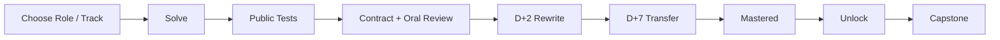

# LLM Interview Lab

> A local-first, role-aware, AI-coached interview workbench for building verifiable skills through structured role interviews, tested exercises, oral review, and spaced retention.

[](https://github.com/ComistryMo/llm_interview_lab/actions/workflows/ci.yml)
[](https://github.com/ComistryMo/llm_interview_lab/releases)
[](pyproject.toml)
[](LICENSE)
[](#project-status)

[**Download Windows App**](https://github.com/ComistryMo/llm_interview_lab/releases/tag/v0.4.0-alpha.1) ·
[**Start in 5 Minutes**](#start-in-5-minutes) ·
[**Browse Curriculum**](#choose-a-track) ·
[**Connect Your AI**](#use-with-ai)


**Role-aware paths · Tested exercises · Structured interviews · AI coaching · Retention**

This is not a random question list, a one-pass mastery badge, or an excuse for AI
to write a learner's answer. One local Profile brings together career materials,
Practice, timed mock interviews, evidence-backed reports, and optional AI help.

The Windows desktop app is the recommended entry point. The complete CLI remains
available for developers, automation, and contributors. Both use the same local
Catalog, Profile, grader, interview engine, and lifecycle rules.

## Why This Project

- **Role-aware preparation.** Eight Role Profiles map a canonical skill ontology
  to seniority-aware interview blueprints, without duplicating the curriculum.
- **Dependency-aware curriculum.** Hard prerequisites form a deterministic DAG;
  Quests provide a recommended narrative and Capstones test integration.
- **Structured interviews.** A fixed Blueprint controls rounds, time, weights,
  public questions, rubric dimensions, evidence, and incomplete outcomes.
- **Private local Workspace.** Career materials, answers, reports, and connection
  metadata live in `workspace/profiles/<id>/`, ignored by Git by default.
- **Deterministic evidence.** Public tests, timers, hashes, unlocks, and retention
  are local code paths. AI prose cannot turn itself into objective evidence.
- **Explicit AI boundaries.** Use no AI, a BYO chat provider, or Codex. Context is
  previewable; secrets use the system keyring; AI never grants mastery.
- **Retention before mastery.** A passing implementation still needs contract and
  oral review plus verified D+2 and D+7 attempts where those assets exist.

The workbench supports these public Role Profiles:

| Role | Typical interview focus |
|---|---|
| AI Product Manager | Problem framing, metrics, risk, delivery, trade-offs |
| Applied AI Engineer | LLM integration, RAG, tools, reliability, evaluation |
| AI Agent Engineer | Tool schemas, execution, state, recovery, agent evaluation |
| AI Algorithm / Research Engineer | Math, PyTorch, Transformer/VLM, experiments |
| Post-Training Engineer | SFT, preference data, reward, DPO/PPO/GRPO |
| AI Infra / ML Platform Engineer | Pipelines, distributed training, reliability |
| AI Inference / Systems Engineer | Serving, KV cache, quantization, kernels |
| AI Evaluation / Data / Safety Engineer | Data quality, rubrics, leakage, safety |

Aliases such as AI Application Engineer, LLM Product Manager, Research Engineer,
ML Systems Engineer, and Inference Optimization Engineer resolve to these shared
profiles instead of creating duplicate skill graphs.

## Start in 5 Minutes

### Windows desktop — recommended

1. Open the [v0.4.0 desktop Alpha release](https://github.com/ComistryMo/llm_interview_lab/releases/tag/v0.4.0-alpha.1).
2. Download `llm-interview-lab-windows-x64.zip` and extract it.
3. Run `LLMInterviewLab.exe`.
4. Create a Profile, select a Role and seniority, then keep **Use without AI** or
   configure a connection later.
5. Choose **Continue** to start the first verified task.

The portable Alpha stores its public assets and private Profiles under
`%LOCALAPPDATA%\LLMInterviewLab`. It creates no account and sends no telemetry.
It currently does **not** bundle CPU PyTorch; install from source for Tensor,
Transformer, optimizer, and post-training coding exercises. Role interviews,
career materials, Foundation exercises, and manual/no-AI workflows are available
in the portable build.

### Clone-first CLI and full desktop

Core CLI supports Python 3.10–3.12. Python 3.11 is recommended and is required
for the optional multi-provider AI bundle.

```bash
git clone https://github.com/ComistryMo/llm_interview_lab.git
cd llm_interview_lab
python -m venv .venv
```

Activate the environment:

```powershell
# Windows PowerShell
.venv\Scripts\Activate.ps1
```

```bash
# macOS / Linux
. .venv/bin/activate
```

Install the core and start one command at a time:

```bash
python -m pip install -e ".[dev]"
llm-lab init --profile default --track ai_foundation
llm-lab doctor
llm-lab next --profile default
llm-lab start FND-001 --profile default
llm-lab test FND-001 --profile default
```

The public starter is expected to fail: it defines the interface, not the
answer. Edit the `submission.py` path printed by `start`, then run `test` again.

For the full Windows GUI, optional AI adapters, and CPU PyTorch exercises:

```powershell
python -m pip install -e ".[desktop,ai,torch,dev]"
llm-lab-gui
```

For CLI-only PyTorch practice, use the smaller optional set:

```bash
python -m pip install -e ".[torch,dev]"
```

Or let the CLI ask only the first essential choices:

```bash
llm-lab quickstart
```

See [Desktop App](docs/desktop-app.md) for installation and troubleshooting,
[Workspace](docs/workspace.md) for local storage, and
[Best Practices](docs/best-practices.md) for a complete first session.

### GUI tour

The four-step onboarding asks only for a Profile, Role, brief self-assessment,
and optional AI connection. Self-assessment changes recommendations; it never
grants mastery.


<details>
<summary>Exercise Workspace, Interview Room, and Connections</summary>

The Exercise Workspace keeps the contract, answer, test output, lifecycle, and
AI drawer together. AI cannot silently edit the answer.


The Interview Room freezes one question at a time, keeps a local clock, and
separates the answer from rubric evidence. Coding rounds use a session-local
copy and the existing grader.


No AI is the default. Provider keys go to the operating-system keyring; Codex
uses its official App Server protocol and explicit approvals.


</details>

## How the Learning Loop Works



> **Public tests passed ≠ mastered.**

Practice states are `not_started → in_progress → implemented → reviewed →
retained_d2 → retained_d7 → mastered`. Missing verified retention assets block
mastery rather than silently weakening the rule. D+2/D+7 attempts do not copy or
show the previous answer.

Interview scores are a separate evidence stream. They do not mutate Practice,
retention, or mastery. A completed report contains question and Skill scores,
cited evidence, confidence, fatal issues, uncertainty, and recommended training.
It never claims an offer probability.

## Choose a Track

Role Profiles weight Skills and recommend existing Tracks and Quests. Tracks do
not duplicate Problem metadata, and interview Blueprints do not rewrite the DAG.

| Track | Focus | Inspect |
|---|---|---|
| AI Foundation | Python, Tensor, loss, optimizer, training basics | `llm-lab graph --track ai_foundation` |
| LLM Algorithm | Transformer, language-model training, post-training | `llm-lab graph --track llm_algorithm` |
| VLM Algorithm | Multimodal data, model flow, training, evaluation | `llm-lab graph --track vlm_algorithm` |
| Post-Training | SFT, preference, reward, policy optimization | `llm-lab graph --track post_training` |
| Agent | Tool calling, trajectory, evaluation, agent training | `llm-lab graph --track agent` |
| Systems | Distributed training, inference, quantization, GPU | `llm-lab graph --track systems` |

```bash
llm-lab catalog
llm-lab graph --quest tensor_and_autograd
llm-lab next --profile default
```

By default, the Planner recommends only `oracle`, `field`, or `stable` Problems.
Contract-only items remain visible but require an explicit experimental opt-in.

## Current Golden Quests

Three continuous coding Quests are currently verified end to end:

| Quest | Required Problems | Capstone | Validation |
|---|---:|---|---|
| Python Data Reliability | 6 | Hard Sample Data Pipeline | Oracle + D+2/D+7 |
| Tensor & Stable Loss | 9 | Masked Sequence Classification Loss | Oracle + D+2/D+7 |
| Optimizer & Training Loop | 6 | Tiny Sequence Classifier Trainer | Oracle + D+2/D+7 |

The broader Catalog contains ready and experimental nodes for Attention, KV
cache, post-training, Agent loops, VLM, inference, distributed systems, and
electives. A `ready` asset is not automatically Oracle-validated; the status is
shown in the GUI and CLI.

## Use with AI

AI is optional. LLM Interview Lab follows **Bring Your Own AI** and provides two
different integration paths.

### Built-in desktop connections

- **Source installs** use a unified provider layer for OpenAI, Anthropic,
  Gemini, Ollama, and OpenAI-compatible endpoints. Python 3.11 and the `ai`
  extra are required.
- The compact **Windows portable Alpha** bundles OpenAI, OpenAI-compatible, and
  Ollama `/v1` support. Native Anthropic/Gemini adapters remain available from
  a source install instead of inflating the first executable with every SDK.
- **Codex** uses the official App Server JSONL protocol for threads, turns,
  streaming events, cancel/retry, diffs, and explicit command/file approvals.
- **No AI** keeps Catalog, grader, review, retention, and manual interviews fully
  usable without credentials or network calls.

Before a remote request, **Context Preview** lists the exact selected parts and
SHA-256 values. The default context is limited to the current public task,
explicitly selected current answer, latest test summary, Role/Skill, help level,
and AI policy. It excludes other Profiles, old answers, private tests, Oracle,
Git history, API keys, and unselected career materials.

Career-tailored interviews require an explicit material ID, allowed purpose,
current SHA-256, and per-session consent. Material text is untrusted evidence:
it cannot issue commands or override repository policy.

<details>
<summary>Career materials and catalog interview CLI</summary>

Add and inspect one sanitized material at a time, or start without any material:

```bash
llm-lab material add --profile default --kind resume --file PATH --title "Sanitized resume"
llm-lab material list --profile default
llm-lab interview create --profile default --mode catalog
llm-lab interview create --profile default --mode tailored \
  --material MATERIAL_ID --consent-materials
```

The `--allow-ai` material flag only establishes eligibility. A tailored session
still requires the current material SHA-256 and explicit consent.

</details>

### Repo-aware coding agents

Codex, Claude Code, Cursor Agent, and similar local agents can use the repository
without the GUI. Start at the repository root and copy this prompt:

```text
Read AGENTS.md and coach/POLICY.md.

Act in COACH mode for profile "default".
Run `llm-lab next --profile default` and then
`llm-lab context --profile default --mode coach`.
Treat its read_allowlist as the complete set of additional files you may read.

Do not modify my submission.
Do not reveal a complete solution.
Use the H0-H5 help policy.
Switch to TEACHER only for an explicit H1/H2/H3 request.
Switch to REVIEWER only after I ask for review.
Do not mark a problem as mastered yourself.
```

### Chat-only AI

For a browser chat that cannot read local files, send only the current `task.md`,
the answer you choose to share, sanitized test output, and desired help level.
Do not upload the whole Profile, employer code, private data, or confidential
documents. A chat response cannot change local mastery.

| AI can help with | AI cannot automatically do |
|---|---|
| Explain current prerequisites | Modify an answer in REVIEWER mode |
| Provide H1/H2/H3 hints | Grant mastery from one passing test |
| Review code, tests, traceback, shapes and masks | Change the fixed curriculum DAG |
| Conduct oral defense and adaptive interview follow-up | Add generated items to the public Catalog |
| Cite answer evidence against a fixed rubric | Treat public tests as anti-cheating hidden tests |
| Suggest the next fixed Problem or Quest | Upload a Profile or prove hostile code is safe |

**AI is a coach and reviewer, not the final authority for mastery.** Detailed
provider, credential, privacy, and Codex behavior is in
[AI Connections](docs/ai-connections.md).

## What Makes It Different

| Common pattern | LLM Interview Lab |
|---|---|
| Flat or random question list | Hard-dependency DAG plus recommended Quests |
| Finish once and move on | Review plus verified D+2 and D+7 |
| Only check whether tests pass | Code, contract, oral, debugging, retention |
| AI writes the answer | H0-H5 modes with explicit read/write boundaries |
| Resume and code mixed into public content | Git-ignored local Profile with consented materials |
| Same sequence for every learner | Role, seniority, Track, prerequisites, evidence |
| Interview feedback is free-form chat | Frozen Blueprint, clock, rubric, evidence, report |
| Generated prompt becomes public content | Fixed curriculum and private AI variants stay separate |

## Local Workspace & Privacy

Every real learner uses one repository-local Profile:

```text
workspace/profiles/<id>/
├── profile.yaml          # role, seniority, preferences
├── events.jsonl          # Practice history source of truth
├── materials/            # explicit manifest + local copies
├── submissions/          # Practice answers
├── interviews/           # sessions, answers, reports
├── generated/            # private AI variants
└── connections.json      # metadata and key references, never plaintext keys
```

Git ignore prevents accidental commits; it is not encryption, backup, or a
provider privacy guarantee. API keys are stored by the system keyring (Windows
Credential Manager on Windows). The project has no account, telemetry, database,
cloud sync, or server. Only content confirmed in Context Preview is sent when a
remote provider is used.

The local grader executes code the user trusts. Path checks prevent accidental
loading of the wrong answer; the grader is **not a hostile-code security sandbox**.
See [Workspace](docs/workspace.md) before adding career or company-related material.

## Project Status

As of **v0.4.0-alpha.1**:

| Measure | Current public state |
|---|---:|
| Ready Problems | 41 |
| Planned Problems | 188 |
| Oracle-validated Problems | 32 |
| Retention-ready Problems | 24 |
| Field-tested runs | 0 |
| Canonical Skills | 70 |
| Role Profiles | 8 |
| Interview Blueprints | 24 |
| Fixed non-coding interview Items | 24 |

This is an **Alpha**. The deterministic core and existing Golden Quests are
well-tested, but the Windows desktop, provider integrations, and cross-role
interview content still need real field validation. The numbers above do not
claim every ready Problem is numerically validated or that any Role path is
complete. Public tests are visible learning contracts, not hidden anti-cheating
tests, and current field runs remain honestly zero.

## Contributing

- Report a broken contract or misleading test with a
  [curriculum issue](https://github.com/ComistryMo/llm_interview_lab/issues/new?template=curriculum.yml).
- Report a desktop, CLI, packaging, or privacy bug with a
  [bug issue](https://github.com/ComistryMo/llm_interview_lab/issues/new?template=bug.yml).
- Improve a fixed Problem, interview Item, Skill, Role, or Blueprint by following
  [CONTRIBUTING.md](CONTRIBUTING.md),
  [Curriculum Authoring](docs/curriculum-authoring.md), and
  [Role Profiles](docs/role-profiles.md).
- Submit real field feedback only through the short
  [Alpha/Beta feedback form](https://github.com/ComistryMo/llm_interview_lab/issues/new?template=beta.yml).

Do not submit complete learner solutions, private Profile data, copied interview
content, employer materials, or unverifiable model-generated questions.

## Roadmap

The next useful work is deliberately narrow:

1. Field-validate the Windows desktop and eight Role Blueprints.
2. Build continuous Transformer and Post-Training role-aware Quests.
3. Add reviewed private AI variants without weakening deterministic mastery.

Installer signing, auto-update, cloud sync, Web UI, and multi-agent runtime are
not part of this Alpha.

## License

[Apache-2.0](LICENSE). Public exercises and interview scenarios are original,
clean-room assets; paper, framework, and official-document sources are recorded
in the public metadata. The optional desktop bundle ships its
[third-party notices](docs/third-party-notices.md) alongside the executable.
