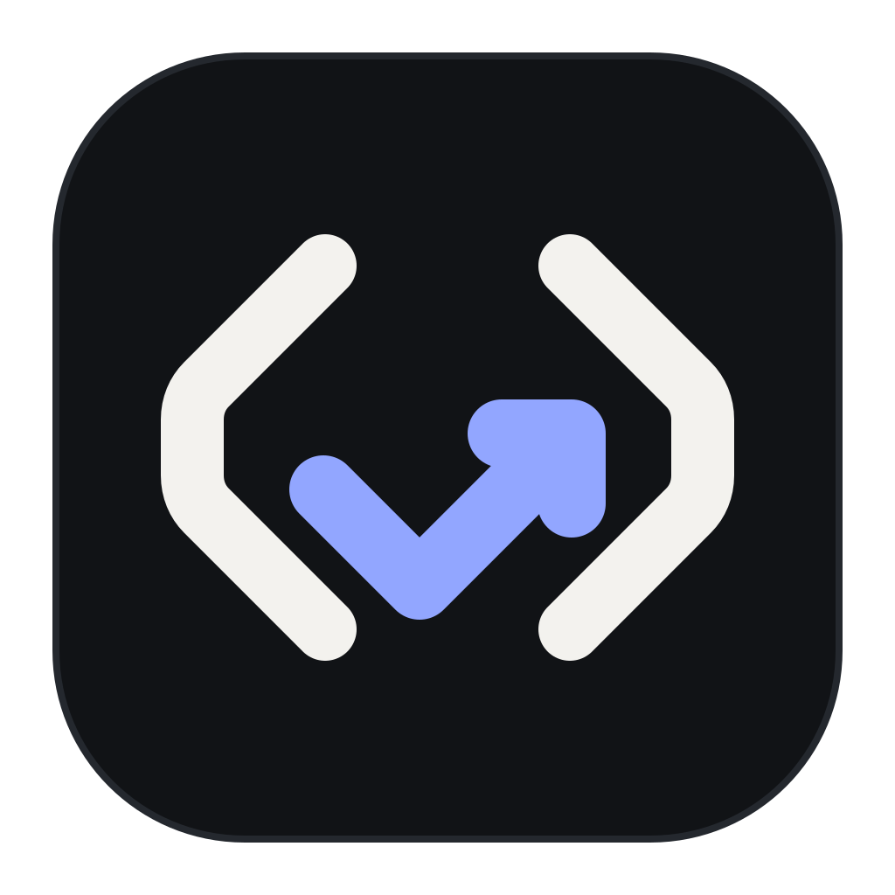
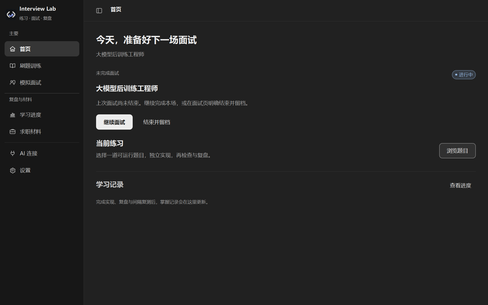

  

# LLM Interview Lab

简体中文 | [English](README.en.md)

**练手撕，讲项目，把 AI 面试完整练一遍。**

LLM Interview Lab 是面向 AI 求职者的桌面练习工具。你可以独立写代码、补基础，也可以带上简历和目标岗位，让 AI 围绕你的经历逐问追问，最后回看回答、代码和需要补强的地方。

[下载应用](#下载) · [第一次使用](#第一次使用) · [使用指南](docs/desktop-app.md) · [反馈问题](https://github.com/ComistryMo/llm_interview_lab/issues)

**目前处于早期预发布迭代，推荐[从源码运行](#从源码运行)。** 本轮源码为 `1.0.1a1`，尚未打包或发布；已有 v1.0.0 下载不包含最新改动。[本轮变化与验证范围](docs/release-notes-v1.0.1-alpha.1.md)

正式应用界面，使用演示资料。支持深浅主题与可收起侧栏。[查看更多界面](docs/design/desktop-candidate-20260909.zh.md)

## 下载

**v1.0.0 · 已发布的历史安装包**（最新预发布改动请使用下方源码入口）

| 系统 | 下载与安装 |
|---|---|
| Windows 10 / 11，64 位 | [下载 Windows 便携版](https://github.com/ComistryMo/llm_interview_lab/releases/download/v1.0.0/LLMInterviewLab-Windows-x64-portable.zip)，完整解压后双击 `LLMInterviewLab.exe` |
| macOS 14+，Apple Silicon | [下载 macOS 安装包](https://github.com/ComistryMo/llm_interview_lab/releases/download/v1.0.0/LLMInterviewLab-macOS-arm64.dmg)，打开后拖入「应用程序」 |

不需要安装 Python。Windows 请保留整个解压目录，不要单独移动 exe；本版不提供 Intel Mac 安装包。

[发布说明](https://github.com/ComistryMo/llm_interview_lab/releases/tag/v1.0.0) · [macOS ZIP 备用下载](https://github.com/ComistryMo/llm_interview_lab/releases/download/v1.0.0/LLMInterviewLab-macOS-arm64.app.zip) · [文件校验值](https://github.com/ComistryMo/llm_interview_lab/releases/download/v1.0.0/SHA256SUMS.txt)

安装包目前没有商业代码签名，macOS 未使用 Apple Developer ID、未公证。首次打开遇到系统提示时，请按 [Windows](docs/windows.md) / [macOS](docs/macos.md) 指南核对来源后打开，不要关闭系统安全保护。

## 能用它做什么

### 围绕自己的经历，练一场面试

面试按「自我介绍 → 经历深挖 → 岗位原理与八股 → 手撕 → 复盘」展开。AI 结合你授权的简历、JD 和已经说过的内容，一次只生成下一问；回答后点击「提交并继续」，不必自己再写一轮提示词。

岗位决定关注什么，简单／标准／困难决定追问的深度、广度和压力。例如准备后训练岗位，可以围绕 SFT、DPO、GRPO 等知识，再结合训练项目讨论实现、实验与取舍。求职者不按实习、校招或工作年限分档。

面试支持暂停、恢复和失败重试；AI 生成期间不扣作答时间。你可以选择 DeepSeek、兼容 OpenAI 的 API、本地 Ollama，或把已安装并登录的 Codex 作为面试官。模型和推理强度在「AI 连接」或 Codex 设置中选择。

### 亲手写代码，把原理讲明白

在「刷题训练」中选择题目，阅读中文要求，在编辑器里实现、运行，再检查结果；需要时可切换英文题目。

- **训练基础**：SGD、Momentum、AdamW、稳定交叉熵、反向传播。
- **模型结构**：RMSNorm、MHA、RoPE、GQA、KV Cache、LoRA。
- **后训练**：SFT Loss Mask、DPO、GRPO、GAE 与相关原理。
- **知识练习**：概念、推导、常见错误和深入追问，与对应手撕题相互关联。

你可以自己写样例并「运行代码」，也可以单独运行题目的「公开测试」。面试中的 AI 会评价代码思路和实现；这与程序有没有实际跑通是两回事。

部分题目需要先完成前置练习；依赖 PyTorch 的题目需要[源码安装](#从源码运行)。完整的题目与可运行范围见[内容说明](docs/content/release-candidate-coverage-20260909.zh.md)。

### 知道这次哪里没答好，下次练什么

面试结束后回看问答记录、优势、主要缺口和后续练习建议。评分引用本次回答或代码；没有回答、没有运行的部分会保留相应说明。

练习进度与面试评价分别保存。公开测试通过不等于已经掌握，还需要能解释做法、处理边界，并在之后独立完成复测。

目前有八类岗位方向：**AI 产品、AI 应用、Agent、算法研究、后训练、ML 平台与 Infra、推理系统、评测与数据安全**。[查看各岗位重点](docs/role-profiles.md)。

## 第一次使用

1. **创建学习档案，选择目标岗位。** 只想刷题，可以先不连接 AI；下次启动会恢复上次档案。
2. **准备模拟面试。** 在「AI 连接」保存自己的服务与模型；有需要时在「求职材料」导入脱敏简历或 JD，支持文本型 PDF、DOCX 和文本文件。
3. **开始面试。** 选择难度与时长，确认本场发送给 AI 的内容，再开始回答。应用会记住上次配置与材料选择；新场次仍需确认发送范围。

首次默认标准难度、60 分钟。材料不是必填项，扫描版 PDF 暂不支持文字识别。[详细操作](docs/interviews.md)。

## 想用语音回答？

可以，**语音识别在本机完成，不需要语音 API Key，也不产生云端转录费用**。

首次使用：在面试回答区点「语音输入」，展开「语音设置」，点击「下载本地模型」。应用会下载、校验并安装约 **1.19 GB** 的模型文件，无需手动解压或配置路径；下载完成后可以离线识别。

之后点击「语音输入」即可边说边看到文字，停句后自动校准。说完点「完成录音」，检查并修改转录文字，再「提交并继续」。

首次加载可能较慢，专业术语、口音和噪声仍可能影响识别。下载需要能访问模型源，失败时可重试。[本地语音使用说明](docs/local-stt.md)。

## 费用、隐私与使用限制

- **费用**：本地刷题与语音识别不需要付费服务。AI 模拟面试使用你自己的连接；云端 API 按服务商规则计费，本项目不提供云端额度。Ollama 可使用本机模型。
- **数据**：档案、材料、回答和录音保存在本机。使用远程面试官时，只发送本场确认的上下文与主动提交的回答；本地录音不会因此自动上传。请勿导入雇主机密。
- **密钥**：API Key 保存在系统密钥环，可复用、修改或删除，不写入仓库。更多说明见 [AI 连接](docs/ai-connections.md)与[数据管理](docs/workspace.md)。
- **代码执行**：只运行你信任的代码。本地执行不提供恶意代码安全沙箱。
- **当前限制**：桌面包未内置 PyTorch；DeepSeek 高推理仍有空正文或请求失败的已知记录。语音准确率、模型响应速度和各设备兼容性仍需持续改进。详见[本版限制](docs/release-notes-v1.0.0.md)。

## 从源码运行

推荐 **Python 3.11**。源码运行不需要构建 exe / mac 应用，适合快速测试与修改。先获取仓库（已有代码可跳过）：

~~~bash
git clone https://github.com/ComistryMo/llm_interview_lab.git
cd llm_interview_lab
~~~

Windows PowerShell：

~~~powershell
# 首次准备环境；只有依赖变化时才需要再执行
py -3.11 scripts/run_desktop.py --setup

# 以后直接启动
.\.venv\Scripts\python.exe scripts/run_desktop.py
~~~

macOS / Linux：

~~~bash
python3.11 scripts/run_desktop.py --setup
.venv/bin/python scripts/run_desktop.py
~~~

**改代码 → 保存 → 关闭并重新启动应用**，无需重新打包。不需要激活环境或手动设置环境变量；普通启动不会重复安装依赖。数据固定保留在 `workspace/maintainer/manual-uat`，重启不会清空；已有环境变量指定的数据目录继续有效。

需要 PyTorch 时，用 `.venv` 的 Python 安装 `-e ".[torch,dev]"`；语音模型在应用内按需下载。源码模式不使用安装包更新器覆盖工作区。

[指定数据目录、首次安装与排错](docs/desktop-app.md#源码运行) · [当前 main 源码](https://github.com/ComistryMo/llm_interview_lab/tree/main)

## 文档与反馈

- [使用文档](docs/README.md)：桌面操作、连接、语音、材料与数据备份。
- [更新记录](CHANGELOG.md)：版本内容与已知变化。
- [报告问题或建议](https://github.com/ComistryMo/llm_interview_lab/issues)：请附复现步骤；截图与日志先脱敏，不要上传 Key 或完整简历。
- [参与贡献](CONTRIBUTING.md)：欢迎改进交互、校对题面、补充经过验证的练习。

[Apache-2.0 许可证](LICENSE) · [第三方软件与模型声明](docs/third-party-notices.md)
