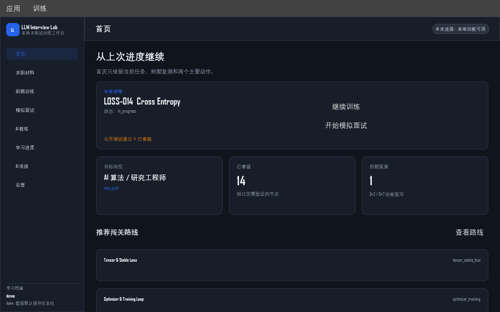
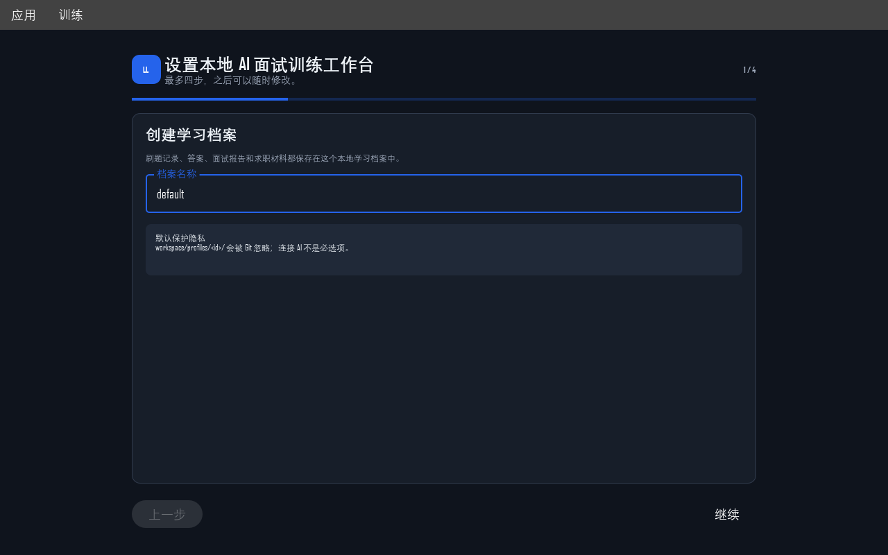
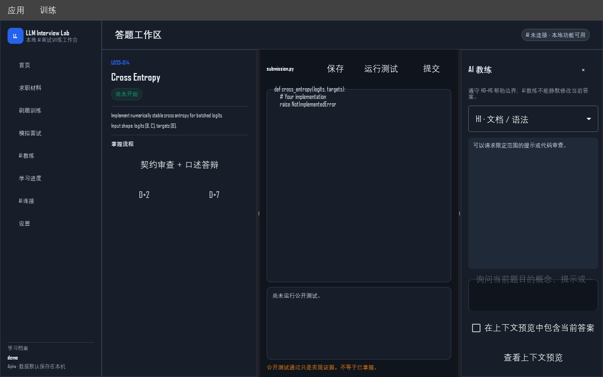
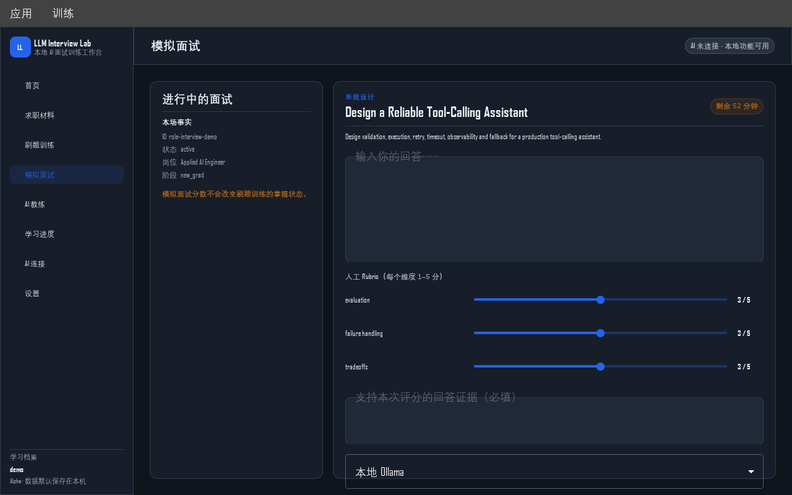
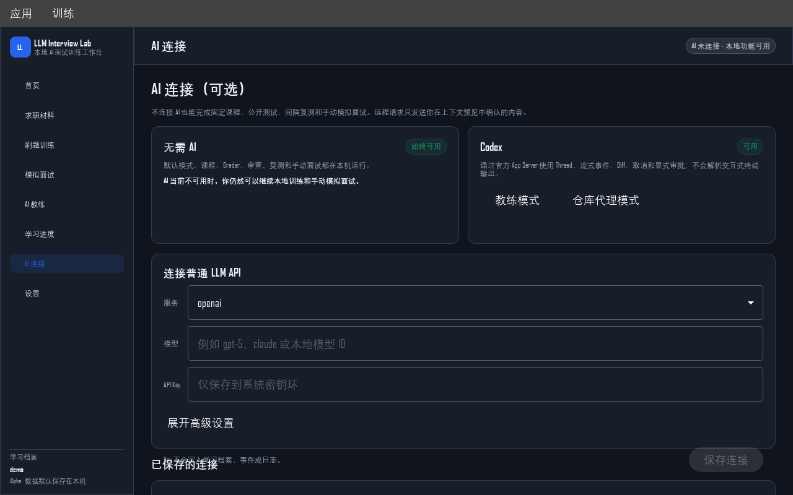
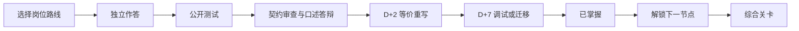

# LLM Interview Lab

[简体中文](README.md) | [English](README.en.md)

> 一个本地优先、岗位感知、AI 辅助的 AI 面试训练工作台：用岗位技能图谱、固定课程、结构化模拟面试、代码测试与间隔复测，把“看懂”变成“能独立实现和解释”。

[](https://github.com/ComistryMo/llm_interview_lab/actions/workflows/ci.yml)
[](https://github.com/ComistryMo/llm_interview_lab/releases)
[](pyproject.toml)
[](LICENSE)
[](#项目状态)

[**下载桌面应用**](#下载与三分钟开始) ·
[**三分钟开始（Start in 5 Minutes）**](#下载与三分钟开始) ·
[**浏览课程（Browse Curriculum）**](#如何开始训练) ·
[**连接 AI（Use with AI）**](#如何接入-ai)



**岗位路线 · 经过测试的练习 · 结构化模拟面试 · AI 教练 · 间隔复测**

这不是随机题单，不是一次测试通过就宣布掌握，也不是让 AI 代写答案。
你可以只刷题，也可以结合自己的脱敏求职材料进行针对性模拟面试；不用连接 AI 也能完整使用确定性的本地功能。

## 这是什么项目

LLM Interview Lab 把三个入口放进同一个本地学习档案（Profile）：

- **求职材料：** 保存简历、求职意向、项目、论文、比赛、岗位 JD 与真实面试问题；只有逐场明确授权的材料才可进入 AI 上下文。
- **刷题训练：** 固定题目按硬依赖组成 DAG，闯关路线（Quest）提供推荐顺序，综合关卡（Capstone）验证组合能力。
- **模拟面试：** 按岗位、求职阶段、难度和时长冻结面试蓝图；一次一个问题，代码题来自经过验证的固定题库，结束后生成有证据的评分卡并留档。

核心设计：

- 硬依赖、测试、计时、解锁和掌握状态由确定性代码计算。
- 公开测试通过只是实现证据；契约审查、口述答辩和 D+2 / D+7 间隔复测共同组成掌握条件。
- AI 可以解释、提示、审查和追问，但不能自行授予“已掌握”。
- 真实答案、材料、面试记录和连接配置默认保存在本机，并被 Git 忽略。

## 适合哪些 AI 岗位

第一版提供八类公共岗位画像。岗位 Alias 复用同一技能图谱，不复制课程：

| 岗位 | 典型面试重点 |
|---|---|
| AI 产品经理 | 问题定义、指标、评测、安全、成本与交付 |
| AI 应用工程师 | LLM API、RAG、Tool Calling、可靠性与评测 |
| AI Agent 工程师 | Tool、Parser、Executor、State、Trajectory 与恢复 |
| AI 算法 / 研究工程师 | 数学、PyTorch、Transformer / VLM 与实验设计 |
| 大模型后训练工程师 | SFT、Preference、Reward、DPO、PPO / GRPO |
| AI Infra / ML 平台工程师 | 数据与训练平台、分布式、Checkpoint 与可观测性 |
| AI 推理 / 系统工程师 | KV Cache、Serving、量化、Kernel 与性能分析 |
| AI 评测 / 数据 / 安全工程师 | 数据质量、Rubric、污染检测、安全与统计分析 |

详见[岗位画像与面试蓝图](docs/role-profiles.md)。

## 下载与三分钟开始

当前版本是 **v0.4.0-alpha.2**。桌面版适合普通用户；源码安装适合开发者、贡献者和需要完整 PyTorch 环境的用户。

| 你使用的环境 | 推荐方式 |
|---|---|
| Windows 10 / 11 x64 | 下载 `LLMInterviewLab-Windows-x64-portable.zip` |
| 只需要单文件 Windows 版本 | 下载 `LLMInterviewLab-Windows-x64.exe` |
| Apple Silicon Mac（M1 及更新） | 下载 `LLMInterviewLab-macOS-arm64.dmg` |
| 需要直接解压验证的 Apple Silicon Mac | 下载 `LLMInterviewLab-macOS-arm64.app.zip` |
| Intel Mac | Alpha.2 暂不提供未经真实运行验证的 x86_64 包 |
| 开发者或贡献者 | 源码安装 |
| 不希望连接 AI | 首次启动选择“暂不连接 AI” |

[前往 v0.4.0-alpha.2 下载页](https://github.com/ComistryMo/llm_interview_lab/releases/tag/v0.4.0-alpha.2)

下载后只需：

```text
打开应用
→ 创建学习档案
→ 选择目标岗位
→ 选择是否连接 AI（默认不连接）
→ 点击“开始训练”
```

普通桌面用户不需要打开终端、编辑 YAML、记 Problem ID 或理解事件 Schema。
Windows 细节见 [Windows 指南](docs/windows.md)，macOS 细节见 [macOS 指南](docs/macos.md)。

### 源码安装

Python 3.11 是推荐版本；核心 CLI 支持 Python 3.10–3.12。

```bash
git clone https://github.com/ComistryMo/llm_interview_lab.git
cd llm_interview_lab
python -m venv .venv
```

激活环境：

```powershell
# Windows PowerShell
.venv\Scripts\Activate.ps1
```

```bash
# macOS / Linux
. .venv/bin/activate
```

安装并启动：

```bash
python -m pip install -e ".[desktop,ai,dev]"
llm-lab-gui
```

只使用 CLI：

```bash
python -m pip install -e ".[dev]"
llm-lab init --profile default --track ai_foundation
llm-lab doctor
llm-lab next --profile default
llm-lab start FND-001 --profile default
llm-lab test FND-001 --profile default
```

公开 starter 预期会失败：它只定义接口，不包含答案。根据 `start` 输出编辑当前 `submission.py`，再运行同一条测试命令。
PyTorch 题使用：

```bash
python -m pip install -e ".[torch,dev]"
```

也可以让 CLI 只询问最必要的首次选择：

```bash
llm-lab quickstart
```

## GUI 使用流程

首次启动最多四步：创建学习档案、选择岗位、可跳过的能力自评、选择 AI。默认选择 **暂不连接 AI**。



首页只突出两个动作：**继续训练** 与 **开始模拟面试**。完整课程、技能和连接配置不会挤在首页。

<details>
<summary>查看答题、面试和 AI 连接界面</summary>

答题工作区把题面、答案、公开测试、审查、间隔复测和可折叠 AI 教练放在一起。AI 不会静默修改编辑器内容。



模拟面试室一次只展示一个主问题，保留本地计时与 Transcript，并将固定 Rubric 客观证据和 AI / 人工判断分开。



AI 连接页面默认强调无需 AI 的本地模式。远程服务发送前必须经过上下文预览；Codex 写操作显示审批卡片与 Diff。



</details>

## 如何开始训练



> **公开测试通过 ≠ 已掌握。**

刷题状态依次为 `not_started → in_progress → implemented → reviewed → retained_d2 → retained_d7 → mastered`。
没有经过验证的复测资产时，系统会明确阻止进入 `mastered`，不会降低标准。

默认 Planner 只推荐 `oracle`、`field` 或 `stable` 节点。仅达到 `contract` 的实验题仍可在完整 Catalog 中查看，但需要主动开启实验题。

```bash
llm-lab catalog
llm-lab graph --track ai_foundation
llm-lab graph --quest tensor_and_autograd
```

当前连续可走通的 Golden Quest：

| 闯关路线 | 必修题 | 综合关卡 | 当前验证 |
|---|---:|---|---|
| Python Data Reliability | 6 | Hard Sample Data Pipeline | Oracle + D+2 / D+7 |
| Tensor & Stable Loss | 9 | Masked Sequence Classification Loss | Oracle + D+2 / D+7 |
| Optimizer & Training Loop | 6 | Tiny Sequence Classifier Trainer | Oracle + D+2 / D+7 |

## 如何进行模拟面试

1. 选择岗位、求职阶段、难度和面试官模式。
2. 可选一份已脱敏材料；应用会展示 material ID、用途和当前 SHA-256，并逐场请求同意。
3. 面试蓝图冻结后一次只问一个问题；代码题只从 `ready` 且达到 `oracle / field / stable` 的固定题库选择。
4. 本地计时器和 Grader 是时间与代码结果的事实来源。
5. 结束后生成整体摘要、Skill 分数、证据、关键缺口、不确定项与推荐训练节点，并保存到当前学习档案。

面试分数不会改变刷题训练、间隔复测或 `mastered`。项目不会生成虚假的 Offer 概率。
更多说明见[结构化模拟面试](docs/interviews.md)。

开发者也可以直接使用同一套本地 CLI（不需要连接 AI）：

```bash
llm-lab material add --profile default --kind resume --file resume.md
llm-lab material list --profile default
llm-lab interview candidates --profile default --track llm_algorithm --difficulty medium
llm-lab interview create --profile default --mode catalog --track llm_algorithm --difficulty medium --duration 30
llm-lab interview create --profile default --mode tailored --track llm_algorithm --difficulty medium --duration 30 --material MATERIAL_ID --consent-materials
```

## 如何接入 AI

这里采用 Bring Your Own AI（自带 AI）方式：你可以选择自己的服务，也可以完全不连接。

AI 是可选能力。支持两种不同用途：

| 方式 | 适合什么场景 | 能力边界 |
|---|---|---|
| 普通 LLM API | 解释、分级提示、只读审查、面试追问 | 只收到上下文预览中勾选的文本，不能操作仓库 |
| Codex | 读取获准文件、运行测试、流式事件、显示 Diff | 使用官方 App Server；命令和写文件遵守 Sandbox 与显式审批 |
| 无 AI | 固定课程、测试、复测、手动模拟面试 | 完全本地，无需网络、账号或密钥 |

桌面便携包重点验证 OpenAI、OpenAI-compatible 与 Ollama 协议；Anthropic / Gemini 的统一 Provider 适配器保留在源码安装中。
CI 只使用 Fake Provider、Fake Codex 与 Mock Keyring，不调用真实付费 API。

### 普通 LLM API

流程被收敛为：选择服务 → 填写 Key 或本地地址 → 选择模型 → 保存 → 测试连接。
高级 Endpoint 和连接 ID 放在折叠区域。API Key 只进入系统密钥环：Windows 使用 Credential Manager，macOS 使用 Keychain；密钥环不可用时不会降级为明文文件。

### Codex

Codex 与聊天 API 不是同一个接口。桌面应用使用官方 App Server 的 Thread、Turn、流式事件、Cancel、Retry、Diff 和 Approval。
macOS 从 Finder 启动时可能没有完整 Shell `PATH`，应用会检查 Homebrew 与常见用户目录，也允许在设置中手动选择 Codex 可执行文件。

任何写文件或高风险命令都会显示：操作、范围、文件、命令、原因、风险以及 Diff。应用不会自动批准全部写操作。

### Repo-aware AI 启动 Prompt

在仓库根目录启动 Codex、Claude Code、Cursor Agent 等能够读取本地仓库的工具，然后复制：

```text
Read AGENTS.md and coach/POLICY.md.

Act in COACH mode for profile "default".
Run `llm-lab next --profile default` and then
`llm-lab context --profile default --mode coach`.
Treat its read_allowlist as the complete set of additional files you may read.

Do not modify my submission.
Do not reveal a complete solution.
Use the H0-H5 help policy.
Switch to TEACHER only for an explicit H1/H2/H3 request.
Switch to REVIEWER only after I ask for review.
Do not mark a problem as mastered yourself.
```

浏览器中的 ChatGPT / Claude 无法访问本地仓库时，只提供当前 `task.md`、你主动选择的答案、脱敏后的测试输出和期望帮助等级；不要上传整个 `workspace/profiles/` 或任何公司内部材料。

详见 [AI 连接与隐私](docs/ai-connections.md)。

## Codex 与普通 API 的区别

- 普通 API 只处理你在上下文预览中确认发送的文本；它不能自行读取本地文件或运行命令。
- Codex 是仓库感知 Agent，可在审批与 Sandbox 约束下读取获准文件、运行测试并提出 Diff。
- Coach / Teacher / Reviewer / Interviewer 模式默认不直接修改学习者答案。
- Repository Agent 只面向维护和贡献场景，写操作仍需审批。
- 两者都不能依据一次测试通过授予 `mastered`。

## 项目的差异化

| 常见学习方式 | LLM Interview Lab |
|---|---|
| 平铺随机题单 | 具有硬依赖的课程 DAG 与推荐闯关路线 |
| 做完一次即结束 | 契约审查 + 口述答辩 + D+2 + D+7 |
| 只看测试是否通过 | 代码、边界、解释、调试和迁移证据 |
| AI 直接给答案 | H0–H5 受约束教练模式 |
| 个人代码混入公共仓库 | Git 忽略的本地学习档案 |
| 所有用户相同顺序 | 岗位画像 + 目标阶段 + 前置依赖 + 个人证据 |
| 面试反馈是自由聊天 | 冻结蓝图、计时、Rubric、证据和本地报告 |
| 临时生成题直接入库 | 固定公共课程与私人 AI 变式分离 |

## 个人数据与隐私

源码模式使用仓库内 `workspace/profiles/<id>/`。打包桌面版使用操作系统应用数据目录：

- Windows：当前用户的标准 App Data 位置；
- macOS：`~/Library/Application Support/LLM Interview Lab/` 对应的 Qt `AppDataLocation`；
- `.app` 内部、`/Applications/` 和公开仓库不会保存真实学习数据。

真实学习档案、答案、求职材料、面试记录、AI 私人变式和连接元数据默认只保存在本机。Git ignore 只防止误提交，不是加密、备份或 Provider 隐私保证。

本地 Grader 只执行用户本人信任的代码。路径检查用于避免误加载，不构成恶意代码安全沙箱。
日志默认不上传，也不记录 API Key、Authorization Header、完整简历、完整答案、Oracle 或 Private Tests。

## 项目状态

截至 **v0.4.0-alpha.2**，数字由当前 Catalog 与公共模型核对：

| 指标 | 当前状态 |
|---|---:|
| Ready Problems | 41 |
| Planned Problems | 188 |
| Oracle-validated Problems | 32 |
| Retention-ready Problems | 24 |
| Field-tested runs | 0 |
| Canonical Skills | 70 |
| Role Profiles | 8 |
| Interview Blueprints | 24 |
| Fixed non-coding interview Items | 24 |

这是 **Alpha**，不是 Beta 或 Stable。Windows 与 macOS 桌面、真实 Provider 和跨岗位面试内容仍需要真实用户验证；当前 field runs 诚实保持 0。
`ready` 不自动等于完成数值 Oracle 验证，公开测试也不是隐藏的防作弊测试。

## 常见问题

### 不连接 AI 能用吗？

可以。课程、DAG、公开测试、Review、D+2 / D+7、进度计算和手动模拟面试均可本地使用。

### API Key 保存在哪里？

系统密钥环。普通配置只保存 Provider、模型、Endpoint 和非敏感 `key_reference`；密钥不会写入 Profile、events、日志或 Release Artifact。

### 我的答案会被上传吗？

不会自动上传。只有你在上下文预览中明确勾选并确认发送的内容才会进入远程请求。Codex 的文件访问还受到当前模式、read allowlist、Sandbox 和审批约束。

### macOS 为什么会显示 Gatekeeper 提示？

Alpha.2 默认是 ad-hoc 签名、未使用 Apple Developer ID 且未经过 Notarization 的测试构建。请先核对 `SHA256SUMS.txt`，再从系统“隐私与安全”页面确认打开。不要运行校验值不一致的文件。

### Intel Mac 可以用吗？

本版只发布在固定 Apple Silicon Runner 上真实构建并启动验证的 arm64 包，不把交叉编译或重命名当作 Intel / Universal 支持。Intel 用户可以尝试源码运行，但不属于本版桌面 Artifact 承诺。

## 参与贡献

- 契约不清或测试误导：[课程问题](https://github.com/ComistryMo/llm_interview_lab/issues/new?template=curriculum.yml)
- 桌面、CLI、打包或隐私错误：[Bug 报告](https://github.com/ComistryMo/llm_interview_lab/issues/new?template=bug.yml)
- 真实 Alpha 体验：[体验反馈](https://github.com/ComistryMo/llm_interview_lab/issues/new?template=beta.yml)
- 贡献规范：[CONTRIBUTING.md](CONTRIBUTING.md) 与[课程编写指南](docs/curriculum-authoring.md)

不要提交完整学习者答案、真实学习档案、雇主材料、来源不明的面试题或未经人工验证的 AI 内容。

## Roadmap

近期只保留三个方向：

1. 真实验证 Windows / macOS 桌面和八类岗位面试蓝图；
2. 建设连续的 Transformer 与 Post-Training 闯关路线；
3. 在不削弱确定性 mastery 的前提下增加经过审查的私人 AI 变式。

自动更新、云同步、Web UI、账号系统和多 Agent Runtime 不属于当前 Alpha。

## License

[Apache-2.0](LICENSE)。`LICENSE` 英文原文具有法律效力；课程和面试内容采用原创 clean-room 设计，来源记录在公共元数据中。桌面包同时提供[第三方软件声明](docs/third-party-notices.md)。
