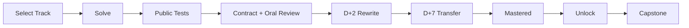

# LLM Interview Lab

> 一个 local-first、dependency-driven、AI-coached 的 AI 算法手撕训练项目：通过固定课程 DAG、代码测试、口述审查与间隔复测，把“看懂”转化为“能够独立实现”。

[](https://github.com/ComistryMo/llm_interview_lab/actions/workflows/ci.yml)
[](https://github.com/ComistryMo/llm_interview_lab/releases)
[](pyproject.toml)
[](LICENSE)
[](#项目状态)

[Start in 5 Minutes](#五分钟开始) · [Browse Curriculum](#选择路线) · [Use with AI](#与-ai-一起训练)

**不是随机题单，不是一次测试通过即掌握，也不是让 AI 直接代写。**

LLM Interview Lab 面向想训练 Python、PyTorch、大模型、后训练、Agent
与训练系统实现能力的学习者。clone 一个仓库，就能在本地完成选题、编码、
测试、Review、D+2/D+7 复测和解锁；个人答案默认不会进入 Git。

## 为什么使用这个项目

- **Dependency-aware curriculum**：硬依赖由固定 DAG 决定，未掌握前置时不能跳关。
- **Quest + Capstone**：小题沿学习叙事组合，最终迁移到一个可测试的完整任务。
- **Local private Workspace**：答案、事件、私人变式都保存在仓库内的 ignored Profile。
- **Deterministic public tests**：测试、SHA 证据、解锁和 mastery 由本地确定性代码处理。
- **AI with explicit boundaries**：AI 按 H0–H5 教学和审查，但不能替学习者授予 mastery。
- **Retention before mastery**：实现后仍需 Contract Review、Oral Defense、D+2 与 D+7。

它适合把“我学过”转成可验证证据：能写、能测、能解释，也能在接口或边界改变后重写。

## 五分钟开始

需要 Python 3.10–3.12；推荐 Python 3.11。项目采用 clone-first、
repository-local 工作流，不要求创建第二个仓库。

```bash
git clone https://github.com/ComistryMo/llm_interview_lab.git
cd llm_interview_lab
python -m venv .venv
```

激活虚拟环境：

```powershell
# Windows PowerShell
.\.venv\Scripts\Activate.ps1
```

```bash
# macOS / Linux
. .venv/bin/activate
```

安装、初始化 Profile，并查看第一项任务：

```bash
python -m pip install -e ".[dev]"
llm-lab init --profile default --track ai_foundation
llm-lab doctor
llm-lab next --profile default
llm-lab start FND-001 --profile default
llm-lab test FND-001 --profile default
```

starter 起始代码预期测试失败，因为它只定义接口而不包含答案。根据 `start`
输出的路径编辑 `submission.py`，再重复运行：

```bash
llm-lab test FND-001 --profile default
llm-lab submit FND-001 --profile default
```

Tensor、Loss、Optimizer 与训练 Capstone 依赖 CPU PyTorch：

```bash
python -m pip install -e ".[torch,dev]"
```

不同平台、ignored Profile 与事件文件的说明见 [Workspace 文档](docs/workspace.md)。

## 学习闭环



> **Public tests passed ≠ mastered.**

一次公开测试通过只证明当前 submission 满足可见契约。完整状态依次为：

```text
not_started
→ in_progress
→ implemented
→ reviewed
→ retained_d2
→ retained_d7
→ mastered
```

Review 记录代码解释、复杂度、边界条件、契约和口述结果。D+2 使用独立
starter 做等价重写，D+7 使用 Debugging 或 Integration 变式；两者都不会复制旧答案。

<details>
<summary>查看 Review 与 Retention 命令</summary>

```bash
llm-lab review FND-001 --profile default \
  --contract passed --oral passed \
  --explanation "Explained validation and counting branches" \
  --complexity "O(n) time, O(1) auxiliary space" \
  --boundaries "Rejects bool and invalid container types"

llm-lab retain FND-001 --stage d2 --profile default
llm-lab retain FND-001 --stage d7 --profile default
```

生产流程按 Review 事件时间计算复测到期日。每个 retention attempt 仍需独立完成
`test → submit → review`，不能用旧 submission 的 PASS 证据替代。

</details>

## 选择路线

Profile 可以选择一个或多个 Track。`next` 只展示当前任务、到期复测和最多三个可解锁节点，
不会默认把完整 Catalog 平铺出来。

| Track | 训练重点 | 查看命令 |
|---|---|---|
| AI Foundation | Python、Tensor、Loss、Optimizer 与训练基础 | `llm-lab graph --track ai_foundation` |
| LLM Algorithm | Transformer、语言模型训练与后训练实现 | `llm-lab graph --track llm_algorithm` |
| VLM Algorithm | 多模态数据流、模型、训练与评测 | `llm-lab graph --track vlm_algorithm` |
| Post-Training | SFT、Preference、Reward 与 RL | `llm-lab graph --track post_training` |
| Agent | Tool Calling、Trajectory、Evaluator 与 Agent 训练 | `llm-lab graph --track agent` |
| Systems | 分布式训练、推理、量化与 GPU 基础 | `llm-lab graph --track systems` |

查看完整目录或某一 Track：

```bash
llm-lab catalog
llm-lab catalog --track llm_algorithm
llm-lab graph --track ai_foundation
```

默认 Planner 只推荐 `oracle`、`field` 或 `stable` 节点。`contract` 节点仍在
Catalog 中可见，但需要 Profile 设置 `allow_experimental_problems=true`，或显式使用：

```bash
llm-lab next --profile default --include-experimental
llm-lab start PROBLEM-ID --profile default --allow-experimental
```

这一区分表示验证成熟度，不表示题目难度。

## 当前 Golden Quests

Golden Quest 是已经能够沿硬依赖连续训练的路径。Problem 需要达到 `mastered`；
Capstone 通过 public tests、Contract Review 与 Oral Defense 后达到 `reviewed`，即可完成 Quest。

### Python Data Reliability

- **适合**：希望在真实数据小任务中恢复 Python 函数、容器、异常、JSONL 与 Iterator 的学习者。
- **路径**：FND-001 → FND-002 → FND-003 → FND-004 → FND-005 → FND-006。
- **规模**：6 个必修 Problem + 1 个 Capstone。
- **Capstone**：`CAP-FND-001 Hard Sample Data Pipeline`。
- **状态**：六题均为 Oracle + D+2/D+7；Capstone 已通过 Oracle 验证。

### Tensor & Stable Loss

- **适合**：需要系统恢复 Tensor shape、broadcast、gather、mask、autograd 与稳定 Loss 的学习者。
- **路径**：TNS-002 → TNS-003 → TNS-006 → TNS-010 → TNS-011 → TNS-013 → LOSS-007 → LOSS-008 → LOSS-014。
- **规模**：9 个必修 Problem + 1 个 Capstone。
- **Capstone**：`CAP-LOSS-001 Masked Sequence Classification Loss`。
- **状态**：九题均为 Oracle + D+2/D+7；Capstone 已通过 Oracle 验证。

### Optimizer & Training Loop

- **适合**：希望把可训练层、Autograd、优化器状态与完整 CPU 训练步骤连接起来的学习者。
- **路径**：NNL-001 → NNL-002 → OPT-001 → OPT-002 → OPT-004 → OPT-005。
- **规模**：6 个必修 Problem + 1 个 Capstone。
- **Capstone**：`CAP-TRN-001 Tiny Sequence Classifier Trainer`。
- **状态**：六题均为 Oracle + D+2/D+7；Capstone 已通过 Oracle 验证。

Quest 中的展示顺序是推荐学习顺序；真正阻止解锁的关系只来自 `prerequisites`。
这能保留清晰叙事，同时避免把 Momentum 等教学顺序误写成 Adam 的算法硬依赖。

## 与 AI 一起训练

项目采用 **Bring Your Own AI**：不绑定模型供应商，不默认调用外部 API，也不包含
模型客户端或运行时多 Agent 系统。固定 DAG、公共测试和 mastery Gate 始终由本地代码决定。

### Repo-aware Coding Agent

适用于 Codex、Claude Code、Cursor Agent，以及其他能读取本地仓库并运行命令的 AI：

1. 在仓库根目录启动 Agent。
2. 让它读取 `AGENTS.md`。
3. 让它读取 `coach/POLICY.md`。
4. 明确当前 `profile_id`，不要让它枚举其他 Profile。
5. 让它运行 `llm-lab next --profile default`，只检查当前任务。
6. 根据目的选择 `TEACHER`、`REVIEWER` 或 `COACH` 模式。

可直接复制以下启动 Prompt：

```text
Read AGENTS.md and coach/POLICY.md.

Act in COACH mode for profile "default".
Run `llm-lab next --profile default` and inspect only the current task.

Do not modify my submission.
Do not reveal a complete solution.
Use the H0–H5 help policy.
Explain prerequisites, give graded hints when requested,
review my tests and code, and conduct oral defense after submission.
Do not mark a problem as mastered yourself.
```

仓库规则见 [AGENTS.md](AGENTS.md)，完整模式和帮助边界见
[Coach Policy](coach/POLICY.md)。

### Chat-only AI

浏览器中的 ChatGPT、Claude 等无法读取本地仓库时，只提供完成当前问题所需的最小上下文：

```text
1. 当前 Problem 的 task.md
2. 你自己的 submission
3. 脱敏后的 llm-lab test 输出
4. 你希望获得的 H0–H5 帮助等级
```

不要上传整个 `workspace/profiles/<id>/`，也不要上传真实公司代码、内部数据、配置、
日志、模型名、指标或截图。AI 的回答不会直接改变本地事件或 mastery 状态。

### AI 可以做什么

| AI 可以做 | AI 不能自动做 |
|---|---|
| 解释当前节点的前置知识 | 在 `REVIEWER` 模式替学习者修改答案 |
| 提供 H1/H2/H3 分级提示 | 凭一次 PASS 授予 mastery |
| 审查代码、测试与 traceback | 修改固定课程 DAG |
| 检查 shape、mask、gradient 与数值稳定 | 把临时生成题自动加入公共 Catalog |
| 进行代码解释与口述追问 | 把公共测试包装成隐藏防作弊系统 |
| 帮助错误归因和复盘 | 上传本地 Profile 或 submission |
| 在固定 DAG 内解释下一步 | 证明本地执行的恶意代码安全 |
| 依据 Schema 设计当前 Profile 的私人变式 | 绕过 Oracle、Review 或 Retention Gate |

**AI 是教练和审查者，不是 mastery 的最终裁决者。**

私人变式只能进入当前 Profile 的 `generated/` 与 `private_tests/`；它们不会自动成为公共题目。

## 差异化设计

| 常见学习方式 | LLM Interview Lab |
|---|---|
| 平铺随机题单 | 具有真实硬依赖的课程 DAG |
| 做完一次即结束 | Review + D+2 + D+7 |
| 只看测试是否通过 | 测试 + 契约 + 口述 + Retention |
| AI 直接给答案 | H0–H5 受约束教练模式 |
| 个人代码混入课程仓库 | Git-ignored Local Workspace |
| 所有用户使用相同顺序 | Profile + Track + prerequisites |
| 临时生成题直接进入题库 | 固定课程与私人 AI 变式分离 |
| 孤立小题 | Quest + Capstone 做集成迁移 |

项目不以题目总数作为掌握证据。`ready`、Oracle、Retention 与真实 field evidence
分别记录，避免把资产存在、数值正确和真实使用混成一个状态。

## Local Workspace 与隐私

真实学习数据位于仓库内部：

```text
workspace/profiles/<id>/
├── profile.yaml
├── events.jsonl          # 唯一学习历史事实源
├── submissions/
├── generated/
├── private_tests/
├── reviews/
├── cache/
└── exports/
```

`workspace/profiles/*` 默认被 `.gitignore` 排除。公共仓库只跟踪 Profile 模板、
Schema、完全虚构的 Demo 和 `.gitkeep`；CI 只读取 Demo，不读取真实 Profile。

```bash
git check-ignore -v workspace/profiles/default/events.jsonl
git status --short
git ls-files workspace/profiles
```

Git ignore 是隐私边界，不是备份系统。请自行备份本地 Profile，也不要使用
`git add -f` 强制提交它。是否把当前代码发送给外部 AI，由用户自己决定。

公共测试不是防作弊隐藏测试，而是确定性的学习反馈。Grader 通过独立子进程提供
超时和输出截断，但 Grader 不是恶意代码安全沙箱；只运行你本人信任的本地代码。

更多设计边界见 [架构说明](docs/architecture.md) 与 [Workspace 文档](docs/workspace.md)。

## 项目状态

**As of v0.3.0-alpha.1**

| 指标 | 数量 |
|---|---:|
| Ready | 41 |
| Oracle-validated | 32 |
| Retention-ready | 23 |
| Field-tested | 0 |

固定 Catalog 另有 **188 个 planned 节点**；它们只有元数据，不创建空题目目录，
也不会被描述为可运行资产。

- `ready` 表示题面、starter、公开测试与提示资产完整。
- `oracle` 表示维护者参考实现通过 public + private/property 验证，且 fingerprint 当前有效。
- `retention-ready` 表示独立 D+2/D+7 资产也通过 Oracle 验证。
- `field-tested` 只统计真实外部训练记录；自动化 E2E 不计入，因此目前仍为 0。

这是公开 Alpha，不是 Beta 或 stable。不是所有 `ready` 节点都已经完成 Oracle 数值验证，
也不承诺所有平台、题目或 AI 工作流都没有问题。欢迎提交可复现、已脱敏的反馈。

当前发布页：[v0.3.0-alpha.1 Releases](https://github.com/ComistryMo/llm_interview_lab/releases)。

## 贡献

欢迎小而可验证的贡献：

- **添加原创题目**：遵循 Catalog、四文件资产和版权边界。
- **改进测试**：补充契约、边界、不变式或透明官方参考对齐。
- **报告问题**：指出含糊题面、误导测试、跨平台故障或隐私风险。
- **提交训练反馈**：记录安装时间、阻塞点和复测体验，不上传答案。

详细规则见 [CONTRIBUTING.md](CONTRIBUTING.md) 与
[课程出题规范](docs/curriculum-authoring.md)。Golden Quest 体验可以使用
[反馈 Issue 模板](https://github.com/ComistryMo/llm_interview_lab/issues/new?template=beta.yml)；
安全或隐私问题请按 [SECURITY.md](SECURITY.md) 私下报告。

开发者的最小验证命令：

```bash
python -m pytest --collect-only -q
python -m pytest -q
llm-lab doctor
```

## Roadmap

近期只聚焦三个方向：

1. **Transformer Quest**：把 Attention、RoPE 与 KV Cache 连接到可验证 Capstone。
2. **Post-Training Quest**：把 SFT、DPO 与 GRPO 组织成连续依赖路径。
3. **Private AI Variants**：完善当前 Profile 内的私人复测生成与验证工作流。

项目不会在这一阶段引入 Web UI、数据库、在线账户或运行时多 Agent 系统。

---

Apache-2.0 License。课程问题和测试为本项目原创 clean-room 资产；引用的论文、
官方文档与框架来源记录在 Catalog 中。
