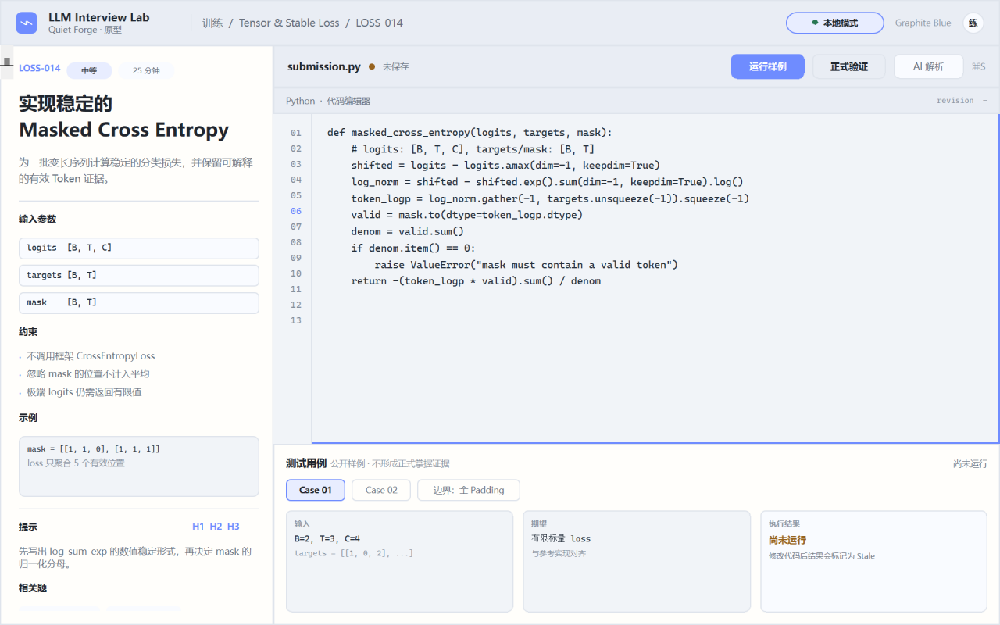
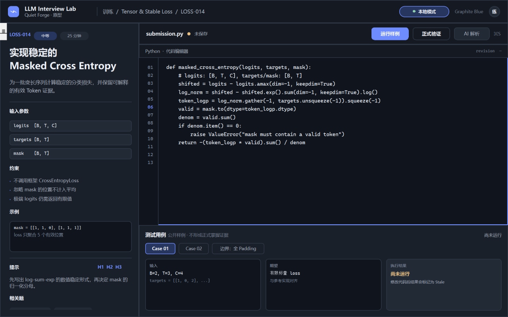
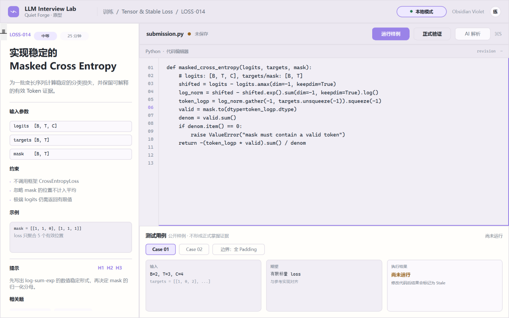
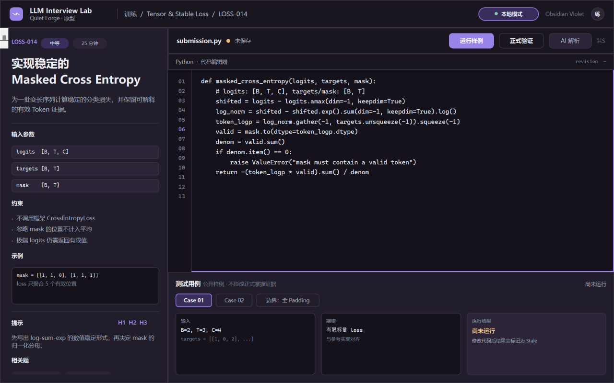
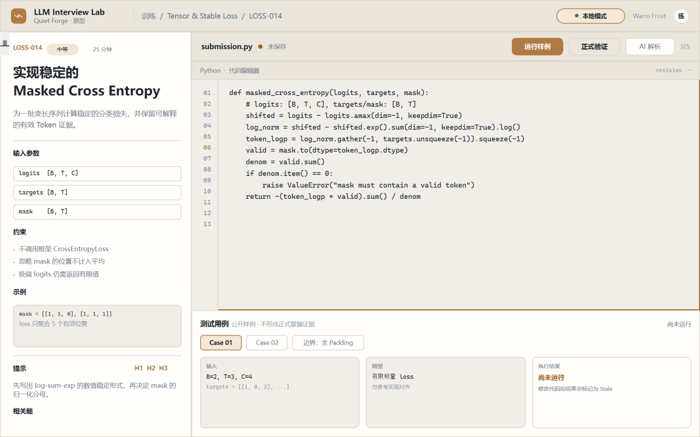
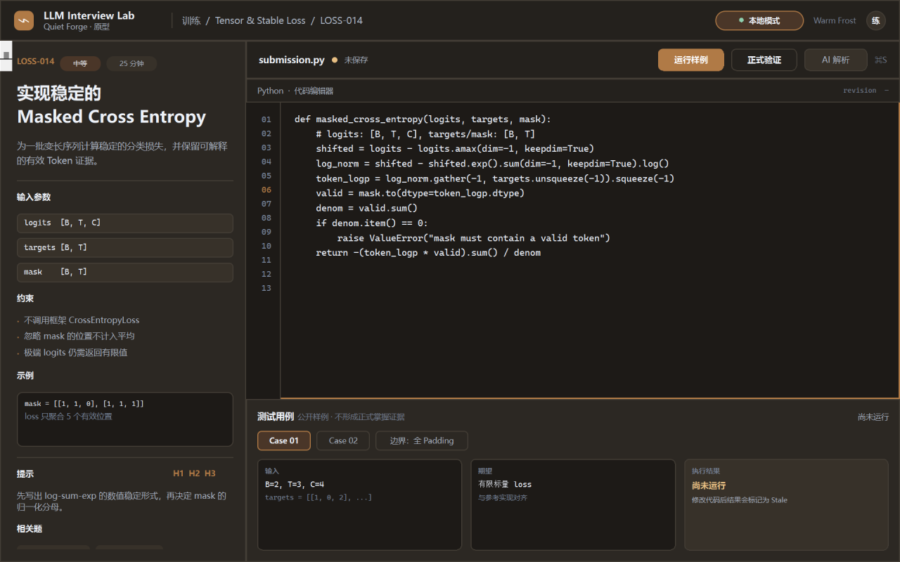

# Product V1 编程工作台视觉方向

> Phase 0 原型评审稿。六张图使用同一份合成中文题面、代码和测试用例，生成于 `scripts/capture_product_v1_visual_directions.py`。原型只验证信息层级与视觉气质，不代表已实现的编辑器、Grader 或面试状态。

## 统一内容与边界

原型内容为 `LOSS-014 · Masked Cross Entropy`，固定呈现：

- 左栏：题目说明、输入 Shape、约束、示例、H1–H3 提示和相关题；
- 右上：`submission.py`、行号、代码编辑器、运行样例/正式验证/AI 解析动作；
- 右下：Case 01、Case 02、全 Padding 边界、输入/期望/执行结果；
- 状态只使用“未保存”“尚未运行”“不形成正式掌握证据”等真实语义，不展示通过率、提交次数或虚构指标；
- 题面、代码和测试输出使用不透明实色；磨砂/高亮只用于顶栏、工具栏、选中标签和状态胶囊；
- 原型不读取 Profile、Catalog、Private Tests、Oracle 或用户文件，全部内容均为 `synthetic: true`。

## 六张方向图

### Graphite Blue





### Obsidian Violet





### Warm Frost





## 对比

| 方向 | 信息密度与对比度 | 长时间阅读 | 品牌辨识度 | QML/跨平台成本 |
| --- | --- | --- | --- | --- |
| **Graphite Blue** | 深色代码区和低饱和蓝色焦点最清楚；浅色层次稳定，分栏边界明确 | 很好，蓝色只作为动作和焦点色，长文本不染色 | 高。与 Quiet Forge 现有蓝色资产连续，也有成熟开发工具气质 | 低。可复用现有 `AppTheme` 的冷中性色；Windows/macOS 一致性高 |
| **Obsidian Violet** | 深色层次柔和，紫色选中态容易形成“氛围”；浅色对比需要更谨慎 | 中上。长时间使用时紫色面积应继续收窄，避免视觉疲劳 | 最高。比通用蓝更有独立品牌记忆点，但过量会接近装饰性 AI 产品 | 中。需要额外检查不同显示器的紫灰对比和无障碍状态色 |
| **Warm Frost** | 浅色题面最舒适，暖灰表面对分栏友好；深色需要维持足够边界对比 | 最好，适合长题面、复盘和材料阅读；代码区仍应保持冷/中性实色 | 中上。安静、专业、偏编辑器/研究工具，不会抢内容注意力 | 低到中。系统主题适配简单，但暖色状态与系统深色模式要单独校准 |

## 与 Codex / Claude Code 类生产力工具的差距

当前原型已借鉴成熟工具的几个结构性特征，而不是复制品牌：

1. **工作上下文优先。** 题面、代码和 Case 在同一 SplitView，工具栏只保留当前动作；没有把聊天面板永久挤进主工作区。
2. **操作层级清晰。** “运行样例”是唯一高强调动作；“正式验证”和“AI 解析”保留边界，不伪装成已经可用的结果。
3. **状态可见但不喧宾夺主。** 未保存、Revision、尚未运行和本地模式均在靠近对象的位置表达，而不是用全局 Toast 覆盖内容。
4. **实色承载长文本。** 代码和题面没有透明/模糊背景，避免阅读和截图中的对比度损失。
5. **仍有差距。** 生产级版本还需要真实编辑器的语法高亮、光标/选择、保存状态和 Diff/Approval；本原型没有宣称这些能力已经完成。

## 推荐决策

**推荐主方向：Graphite Blue。** 它在三项硬约束之间最平衡：代码与题面可读性、深浅主题对比、Windows/macOS 的低风险一致实现。建议吸收：

- 从 Graphite Blue 采用冷中性表面、细分隔线、蓝色焦点环和单一主 CTA；
- 从 Warm Frost 借用浅色长文本区域的暖灰微差，以及更克制的圆角和阴影；
- 从 Obsidian Violet 只借用“低饱和紫蓝作为少量选中/品牌细节”的思路，不把紫色扩散到代码正文、错误和大面积背景。

**不建议现在做：**

- 在用户选定方向前批量替换现有所有 QML；
- 为原型引入新的设计系统、动画、模糊插件或 WebView；
- 把截图中的静态动作误接到 Grader 或 Provider；
- 以截图代替真实 Windows/macOS 可用性验收。

## 原型实现与证据

- QML：`src/llm_interview_lab/desktop/qml/prototypes/ProductV1WorkbenchPrototype.qml`
- 捕获脚本：`scripts/capture_product_v1_visual_directions.py`
- 证据清单：`docs/images/product-v1/manifest.json`
- 生成命令：

```powershell
py -3.11 scripts/capture_product_v1_visual_directions.py --settle-ms 220
```

每张图为 1280×800，内容合成且不含个人材料。用户选择方向后，下一阶段再将经过确认的 token 逐步吸收到正式 Coding Workbench。
