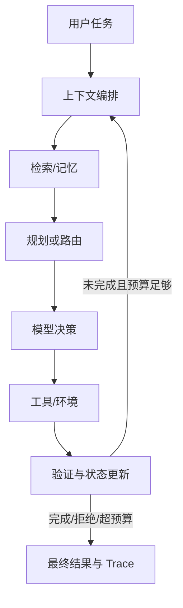

# Agent、RAG、推理服务与评测：面试深度研究附录

> 检索日：2026-08-30（UTC）
> 用途：为 `llm_interview_lab` 的八股、面经和手撕题提供可复核的研究底稿。本文不复制公开面经原文、付费内容、第三方代码或测试；公开面经只作为题型信号，方法定义和工程事实回到论文、官方规范和官方文档核验。

## 0. 使用边界与来源等级

本附录的事实来源按以下顺序使用：

1. 原始论文、标准/协议规范和作者维护的官方仓库；
2. PyTorch、Hugging Face、vLLM、SGLang、NVIDIA 等官方文档；
3. 官方 benchmark 页面、评测框架文档和官方岗位描述；
4. 候选人公开面经。它只能说明“某类岗位曾出现过此主题”，不能推出固定题库、录用标准或公司流程。

所有卡片都应该把“稳定事实”和“版本敏感实现”分开。`main` 分支、leaderboard、在线 API 和动态岗位页均视为 `volatile`，刷新时记录版本、commit 或检索日期。

## 1. 端到端心智模型

Agent 面试不应只回答“模型会不会调用工具”。更完整的系统是：



回答任何系统设计题时，先明确四件事：

- **状态**：用户目标、已观察事实、工具结果、外部环境状态、预算和权限；
- **动作**：自然语言回复、检索、函数调用、写操作、转人工或安全退出；
- **转移**：工具成功/失败、环境变化、重试、重规划和记忆写入；
- **终止**：目标验证通过、不可恢复错误、权限不足、预算/时限耗尽或人工接管。

如果没有状态、转移和终止条件，所谓“Agent”通常只是一个无边界的 prompt loop。

## 2. Agent 与 RAG 的核心知识

### 2.1 Workflow、Agent、ReAct 和规划

[Anthropic 的生产实践总结](https://www.anthropic.com/engineering/building-effective-agents)把预定义代码路径称为 workflow，把由模型动态决定过程和工具使用称为 agent，并建议从最简单的可组合方案开始。面试回答应能解释：固定任务优先 workflow；只有当路径难以预先枚举、环境反馈决定下一步时才引入 agent。

一个最小 ReAct 状态机可写成：

```text
state = {goal, observations=[], plan?, budget, permissions}
while not terminal(state):
    context = curate(state)                 # 预算内的高信号上下文
    decision = model(context, tool_schemas)
    if decision.type == "tool_call":
        validate_schema_and_policy(decision)
        result = execute_with_timeout(decision)
        state = transition(state, result)
    elif decision.type == "final":
        state = verify_or_terminate(state, decision)
    else:
        state = recover_or_abort(state)
```

**必须说清的边界**：模型生成的工具参数不是权限判定；工具返回的文本是外部数据，不是高优先级指令；最终文字声称“已完成”不等于环境状态真的完成。

规划层的常见取舍：

| 方案 | 优点 | 代价/风险 | 适合考察 |
|---|---|---|---|
| 单步 ReAct | 简单、低延迟、易调试 | 长任务易循环、局部贪心 | 状态机、停止条件 |
| Plan-and-Execute | 子目标显式、可审计 | 计划过时，执行偏离计划 | 重规划、计划校验 |
| Tree/Beam/LATS | 可探索多条路径、利用环境反馈 | token/工具成本高，价值函数偏差 | 搜索预算、剪枝、回溯 |
| 多 Agent | 角色隔离、并行 | 协议复杂、共享状态冲突、成本乘法 | 何时不该多 Agent |
| 固定 workflow + 局部 agent | 可控且保留灵活性 | 编排工作量较高 | 生产落地判断 |

可关联的原始来源：[ReAct](https://arxiv.org/abs/2210.03629)、[Plan-and-Solve](https://arxiv.org/abs/2305.04091)、[LATS](https://arxiv.org/abs/2310.04406)、[Self-Refine](https://arxiv.org/abs/2303.17651)。这些论文的实验数字不可直接外推到当前模型或业务；面试中应把它们当作设计模式和消融思路，而不是生产保证。

### 2.2 记忆与上下文工程

记忆不是“把全部历史拼到 prompt”。至少区分：

- **工作记忆**：当前轮目标、最近工具结果、未完成子目标；
- **情节记忆**：过去事件及其时间/来源/置信度；
- **语义记忆**：压缩后的稳定事实、用户偏好、领域知识；
- **外部状态**：数据库、文件、工单等真实状态，不能只存在模型上下文。

[Generative Agents](https://arxiv.org/abs/2304.03442)采用观察、记忆检索、反思和计划的组合；[MemGPT](https://arxiv.org/abs/2310.08560)把上下文看成类似虚拟内存的分层存储；[Reflexion](https://arxiv.org/abs/2303.11366)把反馈转成可检索的文字记忆而不是更新权重。它们共同提示一个面试要点：记忆的价值取决于**写入准则、召回准则、冲突处理和遗忘策略**，不只是向量数据库。

上下文预算可用一个工程化目标表达：

```text
maximize  expected_task_utility(context)
subject to prompt_tokens <= budget,
           latency <= SLO,
           permissions(context) <= user_scope
```

压缩/选择策略及故障：

| 策略 | 适用 | 需监控的失败 |
|---|---|---|
| 最近窗口 | 强时序、多轮对话 | 关键早期事实丢失 |
| 摘要/反思 | 长会话、任务复盘 | 摘要幻觉、细节不可逆丢失 |
| 语义检索 | 大量历史、知识库 | 相似但不相关、时效错配 |
| 结构化状态 | 订单/代码/流程 | schema 演化、写入竞态 |
| 分层内存 | 超长任务 | 召回延迟、stale memory、权限泄露 |

[Anthropic 的 context engineering 指南](https://www.anthropic.com/engineering/effective-context-engineering-for-ai-agents)强调上下文是有限且边际收益递减的资源；[Lost in the Middle](https://arxiv.org/abs/2307.03172)显示相关证据位于长上下文中部时，模型可能明显退化。因此“支持百万上下文”不等于“可以不检索、不压缩”。

### 2.3 RAG 数据流与检索指标

典型 RAG：

```text
文档 -> 清洗/切分 -> 稀疏索引(BM25) + 稠密索引 -> 召回 top-k
     -> 融合/去重 -> rerank -> 上下文编排 -> 生成 -> 引用/事实校验
```

[RAG 原论文](https://arxiv.org/abs/2005.11401)的核心是参数记忆与非参数外部索引结合；[GraphRAG](https://arxiv.org/abs/2404.16130)针对跨文档全局问题引入实体图和社区摘要。面试中要先问清任务是局部事实查找、跨文档聚合，还是需要写操作；不要把 GraphRAG 当作所有场景的默认升级。

常用指标：

- `Recall@k = 命中的相关文档数 / 相关文档总数`：召回器上限，不代表答案正确；
- `MRR = 1 / 第一个相关文档排名` 的均值：强调第一条证据；
- `nDCG@k`：考虑相关性等级和排名折扣；
- answer EM/F1 或任务级正确率：生成结果；
- groundedness/faithfulness：答案主张能否由证据支持；
- citation precision/recall：引用是否真的支持主张、是否遗漏关键证据；
- abstention rate：证据不足时是否拒答或请求澄清；
- p50/p95 检索、rerank、生成延迟和单请求成本。

RAG 故障注入应至少覆盖：切片边界截断表格/代码、embedding 模型替换、top-k=0、相似度阈值过高、重复文档、过期文档、恶意文档指令、引用错配、索引不可用和跨租户召回。

### 2.4 Tool calling、MCP 与安全边界

[MCP 2026-07-28 规范](https://modelcontextprotocol.io/specification/2026-07-28/server/tools)将工具定义为带唯一名称、描述和 JSON Schema 的能力；规范建议工具列表稳定排序，并要求敏感操作保留用户拒绝/确认能力。[Resources 安全条款](https://modelcontextprotocol.io/specification/2026-07-28/server/resources)要求校验 URI、检查权限并防止 `file://` 路径遍历；其架构页说明 JSON-RPC 数据层与 stdio/Streamable HTTP 传输层是不同边界。

工具执行应分成四步：

1. **发现**：按租户/权限过滤工具，稳定排序并带版本；
2. **计划**：模型选择工具和参数，但不能扩大权限；
3. **执行**：服务端做 schema、业务规则、超时、幂等键、速率和审批校验；
4. **观测**：记录参数摘要、结果摘要、状态 diff、错误类型、重试次数和 trace parent。

安全威胁可用 [OWASP LLM Top 10](https://owasp.org/www-project-top-10-for-large-language-model-applications/)、[间接 Prompt Injection 论文](https://arxiv.org/abs/2302.12173)和 [ToolEmu](https://arxiv.org/abs/2309.15817)核验：外部检索内容可能伪装成指令；输出若未经校验可能触发代码/SQL/HTML 风险；过宽工具权限会放大模型错误。防护不是单一 system prompt，而是**数据/指令隔离、最小权限、参数 allowlist、沙箱、人工确认、审计与可撤销性**的纵深防御。

### 2.5 公开面经的题型信号（不作为事实来源）

同日交叉阅读的公开报告显示，Agent/推理岗位常把项目追问和系统设计连起来：工具 schema 与 JSON 解析之后，继续问上下文预算、记忆压缩、重试/熔断、RAG 召回与 rerank，再落到 vLLM/KV cache、延迟和线上评测。比如[字节大模型候选人报告](https://www.nowcoder.com/discuss/922308546966847488)、[阿里大模型候选人报告](https://www.nowcoder.com/discuss/923309531445071872)、[Agent 项目拷打整理](https://blog.csdn.net/Python_cocola/article/details/160830767)和[训练岗面经](https://juejin.cn/post/7648887289629179958)都能观察到相近主题，但样本、岗位和年份不一致。

因此本项目只提炼以下**可迁移能力**，不保留原题原文或声称“某公司必问”：

| 面经信号 | Clean-room 转写的能力 | 回到哪类权威来源核验 |
|---|---|---|
| Agent 四层/多 Agent 追问 | 状态、编排、工具、记忆、观测与何时保持单 Agent | Anthropic workflow/agent 指南、MCP 规范 |
| RAG 与长上下文追问 | 召回/rerank/引用、context budget、证据不足退出 | RAG、Lost in the Middle、GraphRAG |
| vLLM/推理性能追问 | prefill/decode、KV/page、continuous batching、TTFT/ITL/TPOT | vLLM/SGLang/Orca/PagedAttention |
| 失败与线上指标追问 | timeout、限流、幂等、恢复率、p99 和 trace 归因 | Anthropic eval 指南、官方 benchmark 文档 |

公开报告的发布日期、页面内容和题型会变化；刷新时只更新“观察范围/置信度”，不要把它们升级为方法定义或招聘承诺。

## 3. 推理与 serving：从 prefill 到多租户请求

### 3.1 Prefill/decode 的区别与指标

对 decoder-only Transformer，给定 batch `B`、输入长度 `S`、隐藏维 `d`：

- prefill 一次处理整段 prompt，注意力部分近似 `O(B·S²·d)`，矩阵乘部分约 `O(B·S·d²)`；适合大矩阵并行，通常计算受限；
- decode 每次只生成一个或少量 token，需要读取历史 KV，单步注意力约 `O(B·S·d)`，还要执行投影/MLP；常受显存带宽和 KV 读取限制；
- 具体复杂度随稀疏注意力、GQA/MLA、分块和 kernel 实现改变，不能只背一个 `O(n²)`。

在线指标应定义清楚：

```text
TTFT = 从请求到首个输出 token 的时间（含排队、预处理和 prefill）
ITL  = 相邻流式输出之间的间隔
TPOT = (E2E - TTFT) / (输出 token 数 - 1), 输出超过 1 token 时定义
E2E  = 从请求到最后一个输出 token 的时间
goodput = 满足 TTFT/TPOT/E2E SLO 的请求或 token 吞吐
```

[vLLM metrics](https://docs.vllm.ai/en/latest/design/metrics/)和[benchmark CLI](https://docs.vllm.ai/en/latest/benchmarking/cli/)明确区分 TTFT、ITL、TPOT、E2E、排队时间、prefill 时间、运行/等待/换出请求数和 KV 使用率；[SGLang benchmark](https://docs.sglang.ai/developer_guide/benchmark_and_profiling.html)也建议固定 QPS/并发、足够请求数后报告 TTFT、TPOT、ITL 与吞吐。只报平均 tok/s 会掩盖 p99 尾延迟和长 prompt 对 decode 的干扰。

### 3.2 KV cache、GQA 与分页

若每层 K/V 使用相同 dtype，KV cache 字节数近似：

```text
bytes = 2 * num_layers * batch * cached_tokens
        * num_kv_heads * head_dim * bytes_per_element
```

MHA 中 `num_kv_heads = num_attention_heads`；GQA 让多个 query head 共享一组 KV；MQA 则近似只有一组 KV。因此 GQA/MQA 主要节省 KV 容量和带宽，不等于所有 attention 计算都按比例消失。量化 KV 还需加 scale/metadata，并验证误差和 kernel 支持。

传统连续大块分配会产生内部碎片和搬移开销。[PagedAttention/vLLM 论文](https://arxiv.org/abs/2309.06180)把逻辑 token 块映射到非连续物理块，用 block table 管理 KV，并支持共享前缀；[vLLM automatic prefix caching](https://docs.vllm.ai/en/latest/features/automatic_prefix_caching/)说明共享 prompt 可跳过重复 prefill。面试追问要覆盖：

- block size 如何影响内部碎片、block table 开销和 kernel 访存；
- prefix cache 的 key 必须包含规范化 token、模型/adapter 版本、工具 schema 和安全租户边界；
- prefix 命中不能绕过权限检查；
- eviction 应考虑 LRU/频率、租户配额、正在运行请求和 pinned block；
- preemption/swap 时需要恢复 block 映射和请求状态，而不只是复制一段 tensor。

### 3.3 Continuous batching、chunked prefill 与调度

[Orca](https://www.usenix.org/conference/osdi22/presentation/yu)提出 iteration-level scheduling：每个迭代只推进仍未完成的请求，新请求可以加入，不必等最长请求结束。vLLM/SGLang 在此基础上采用 paged KV、连续批处理和 chunked prefill。调度器每步通常受 token budget、KV 空闲块、最大 batch、优先级和公平性约束。

`chunked prefill` 将长 prompt 拆块并与 decode 混合：

- chunk 大：prefill kernel 效率好、吞吐高，但会阻塞 decode，ITL/p99 变差；
- chunk 小：decode 更平滑，调度开销和 kernel launch 增加，prefill 吞吐可能下降；
- 目标不是“永远更小”，而是在业务 TTFT、ITL 和总吞吐 SLO 下调 token budget。

常见调度故障注入：一条超长 prompt、短请求洪峰、输出长度长尾、KV 达到 95% 以上、频繁 preemption、优先级反转、流式客户端断开、单租户霸占 cache、prefill starvation 和 decode starvation。验收要记录 admission decision、每轮 token 数、队列等待、preemption 原因和最终状态。

### 3.4 Speculative decoding

草稿模型先提出 `k` 个 token，目标模型一次前向验证；对自回归分布 `p` 和草稿分布 `q`，典型 rejection sampling 对草稿 token `x` 的接受概率为 `min(1, p(x)/q(x))`，拒绝时从修正分布采样，因此在假设满足时可保持目标采样分布不变。[原始论文](https://arxiv.org/abs/2211.17192)给出无需改变输出分布的并行验证思路；[vLLM speculative decoding 文档](https://docs.vllm.ai/en/latest/features/speculative_decoding/)提醒其主要适合中低 QPS、memory-bound 工作负载。

要测而不是只背“加速”：

```text
acceptance_rate = accepted_draft_tokens / drafted_tokens
tokens_per_target_step = accepted + 1 (含修正 token 的近似口径需注明)
speedup = baseline_decode_time / speculative_decode_time
```

草稿模型太弱会接受率低；太大则草稿成本抵消收益；采样温度、top-p、模型族、batch 和共享 prefix 都会改变结果。故障注入包括 draft/target tokenizer 不一致、EOS 提前、stop sequence、logits processor 不一致、随机种子不一致和拒绝后 KV 回滚错误。

### 3.5 量化与并行策略

量化回答应先说明目标：降低显存、提高带宽利用率、提升吞吐，还是允许更大 batch。常见格式：

| 格式 | 权重/激活 | 典型优点 | 典型风险 |
|---|---|---|---|
| W4A16 (AWQ/GPTQ) | INT4 权重、FP16/BF16 激活 | 权重显存和带宽显著下降 | dequant/packing kernel、校准迁移、长尾质量 |
| W8A8 | INT8/FP8 权重与激活 | Tensor Core 友好，吞吐潜力高 | 激活 scale、outlier、硬件依赖 |
| FP8 | FP8 权重/激活，通常动态或静态 scale | 浮点动态范围、服务器硬件支持 | scale 粒度、累加精度、硬件/版本差异 |

[AWQ](https://arxiv.org/abs/2306.00978)根据激活统计保护少量显著通道，不需要反向传播；[GPTQ](https://arxiv.org/abs/2210.17323)使用近似二阶信息做一次性权重量化；[FP8 Formats](https://arxiv.org/abs/2209.05433)讨论 FP8 格式与训练/推理。当前 vLLM 的[量化文档](https://docs.vllm.ai/en/latest/features/quantization/)强调具体格式和硬件支持是版本敏感的，不能从论文结果直接承诺线上收益。

并行策略的面试最小模型：

- **TP**：层内切分，常有 all-reduce/all-gather；降低单卡参数，但通信频繁，适合高速互联；
- **PP**：按层切分，通信次数较少但有 pipeline bubble，micro-batch 越多通常越能填充流水；近似 bubble 比例可写成 `(p-1)/(m+p-1)`（具体调度会改变）；
- **DP**：复制模型、切 batch，吞吐好但每副本都占权重，长请求负载不均；
- **EP**：MoE 专家切分，需要 token all-to-all，路由不均和网络拥塞是核心风险；
- 实际系统常组合 TP/PP/DP/EP，并按 prefill/decode、attention/FFN 做不同并行或 disaggregation。

## 4. Agent Trace、评测与上线门禁

### 4.1 Trace 最小 schema

一个可复盘的 trace 至少包括：

```json
{
  "run_id": "...",
  "task_id": "...",
  "model_id": "...",
  "model_revision": "...",
  "harness_revision": "...",
  "seed": 0,
  "input_hash": "...",
  "events": [
    {"type":"llm_generation", "parent_id":"...", "prompt_tokens":0,
     "output_tokens":0, "latency_ms":0, "finish_reason":"..."},
    {"type":"tool_call", "tool":"...", "args_hash":"...",
     "permission_decision":"allow|deny|confirm", "latency_ms":0,
     "error_class":null},
    {"type":"state_diff", "entity":"...", "before_hash":"...",
     "after_hash":"..."}
  ],
  "outcome": {"environment_checks": [], "final_answer_grade": null},
  "termination": "success|failure|abstain|timeout|human_handoff"
}
```

参数和结果默认做 hash/脱敏；原始内容按租户、保留期和访问审计策略保存。trace 是调试证据，不是把 chain-of-thought 全量暴露给用户的理由。[OpenAI Agents SDK tracing](https://github.com/openai/openai-agents-python/blob/main/docs/tracing.md)按 trace/span 组织 LLM generation、tool、handoff、guardrail 等事件；[Anthropic eval 指南](https://www.anthropic.com/engineering/demystifying-evals-for-ai-agents)强调要同时保存 transcript 和最终 environment outcome。

### 4.2 Outcome、trajectory 与统计

不能只看最终文字：

- **Outcome grader**：数据库/文件/单元测试/业务状态是否达到目标；
- **Trajectory grader**：是否选对工具、参数、顺序、权限、重试和停止；
- **Safety grader**：是否泄露、越权、执行危险副作用；
- **Efficiency grader**：token、工具次数、时延、金钱和 GPU 资源。

随机模型必须多次 trial。常见定义：

```text
pass@k = 至少一次成功的试验比例
pass^k = k 次独立试验全部成功的比例（更严格的可靠性）
tool_success = 成功工具调用数 / 工具调用总数
invalid_call_rate = schema/权限/业务校验失败调用数 / 总调用数
recovery_rate = 注入故障后最终完成的 trial / 含故障 trial
```

报告均值之外，给出 p50/p95/p99、bootstrap 置信区间、失败类型分桶和成本。LLM judge 要用人工标注校准集、盲测模型版本、inter-rater agreement、位置/长度偏差和 judge drift；关键安全和交易结果必须有代码/环境断言，不能只用另一个 LLM 打分。

### 4.3 推荐 benchmark 及其边界

| Benchmark/框架 | 测什么 | 面试使用方式 | 注意事项 |
|---|---|---|---|
| [BFCL](https://gorilla.cs.berkeley.edu/leaderboard.html) | 函数选择、参数、串行/并行调用、可执行性和部分 agentic 场景 | 设计 AST/结构化调用 grader | leaderboard 会更新，固定版本和 split |
| [τ-bench / τ²-bench](https://github.com/sierra-research/tau2-bench) / [τ² verified](https://github.com/amazon-agi/tau2-bench-verified) | 用户模拟器、企业工具、政策遵循、多轮任务；可报告 pass^k | 分析政策、状态和重复试验 | 仓库已出现版本演进/修正，不能混报 |
| [WebArena](https://webarena.dev/) | 自托管真实网页、多步导航和最终状态 | 端到端长程 agent | 环境版本、网页状态和浏览器差异影响复现 |
| [GAIA](https://arxiv.org/abs/2311.12983) | 现实助手、多模态、浏览和工具综合能力 | 检查工具链而非只看 QA | 答案集和工具权限必须隔离 |
| [API-Bank](https://arxiv.org/abs/2304.08244) | 规划、API 检索、参数和执行 | 训练/评测工具调用数据流 | 规模与现代工具 schema 有差异 |
| [ToolEmu](https://arxiv.org/abs/2309.15817) | 高风险工具的沙箱安全和风险评估 | 故障注入、拒绝与升级 | LM evaluator 仍需人工校准 |
| [Anthropic eval design](https://www.anthropic.com/engineering/demystifying-evals-for-ai-agents) | task/trial/grader/transcript/outcome/eval harness 设计 | 建立项目自己的回归套件 | 不是一个单一 leaderboard |

### 4.4 故障注入与发布门禁

建议为每类任务建立 deterministic fault matrix：

| 注入点 | 示例 | 期待行为 | 观测字段 |
|---|---|---|---|
| 检索 | 空召回、过期证据、恶意指令 | 降级/澄清/拒答，不执行外部指令 | hit@k、证据年龄、引用支持 |
| 工具 schema | 缺字段、类型错、工具列表变更 | 本地校验、修正一次或请求澄清 | validation_error、schema_rev |
| 网络/服务 | timeout、429、5xx、重复响应 | 指数退避+幂等键+上限，必要时熔断 | retry_count、backoff、breaker |
| 业务状态 | 并发写冲突、部分成功 | 事务/补偿/人工接管 | before/after hash、side_effect |
| 模型 | 乱调用、循环、幻觉完成 | 预算、loop detector、环境断言 | step_count、termination_reason |
| 评测 | judge 漂移、golden 变更 | 版本锁定、校准集、回滚 | judge_rev、CI diff |
| serving | KV 满、长 prompt、decode starvation | admission/preemption/降级 | queue、KV%、TTFT/ITL p99 |

发布门禁可写成：

```text
ship iff
  outcome_success >= baseline - delta
  and safety_violation == 0 on protected set
  and p99_TTFT/TPOT <= SLO
  and cost_per_success <= budget
  and no critical regression in failure buckets
```

## 5. 建议新增的 P0/P1 面试卡（可直接转为知识库卡）

以下是 clean-room 原创的卡片草案；题面、starter、测试应另行编写，不直接复制 benchmark 或面经。

### P0：所有目标大模型算法/Agent/推理岗位

| ID | 题目 | 一句话验收 | 必追问 | 典型坑 |
|---|---|---|---|---|
| AGT-CORE-001 | 设计可终止的 ReAct Agent loop | 给出 state/action/observation/termination 和预算 | 工具失败如何重试？如何防循环？最终成功如何由环境验证？ | 把模型文本当作事实；没有停止条件 |
| AGT-CORE-002 | Tool calling 的 schema、权限与幂等 | 模型只能提议，服务端决定是否执行 | 并行调用何时安全？重复支付如何避免？ | 只依赖 system prompt；无幂等键 |
| AGT-RAG-001 | 从文档到答案的 RAG pipeline | 召回、rerank、生成、引用和 abstain 可单独测量 | chunk 如何切？top-k 如何调？召回高但答案差怎么办？ | 把向量相似度当事实正确 |
| AGT-RAG-002 | 间接 prompt injection 防御 | 外部数据与指令隔离，最小权限和可审计 | 恶意 PDF/网页如何测试？输出到 SQL/HTML 怎么办？ | 认为加一句“忽略指令”即可解决 |
| AGT-MEM-001 | 长任务上下文/记忆设计 | 分工作记忆、长期记忆、真实外部状态并定义写入/召回 | 摘要错了能否恢复？偏好冲突怎么办？如何按租户隔离？ | 全量拼历史；无限写入无 TTL |
| AGT-EVAL-001 | 评测一个多轮 Agent | task/trial/trace/outcome/grader/harness 完整闭环 | pass@k 与 pass^k？如何做 judge 校准？ | 只评最终回答；只跑一次 |
| INF-CORE-001 | 解释 prefill/decode 与 TTFT/TPOT/ITL | 说明计算/带宽差异和可观测指标 | 长 prompt 为什么拖慢 ITL？chunk size 怎么选？ | 把 TTFT 当纯模型时间 |
| INF-KV-001 | 推导 KV cache 显存并解释 GQA | 给出 `2·L·B·S·Hkv·D·bytes` 并说明 MHA/GQA/MQA | page/block table 怎么做？prefix cache 如何隔离？ | 忘记 K/V 因子 2；忽略 dtype/scale |
| INF-SCHED-001 | 实现/设计 continuous batching scheduler | 每轮按 token budget、KV 和公平性增量调度 | prefill starvation？preemption 如何恢复？ | 静态 batch 等最长请求 |
| INF-SPEC-001 | 说明 speculative decoding 正确性与收益 | draft 提议、target 验证、拒绝修正、接受率和 speedup | tokenizer 不同怎么办？为什么低接受率反而变慢？ | 只说“并行生成”不提分布保持 |
| INF-QUANT-001 | AWQ/GPTQ/FP8/W4A16 选型 | 按硬件、校准、质量、带宽和 kernel 解释 | 激活 outlier？量化 KV？VLM 哪些层更敏感？ | 把论文 speedup 当所有硬件保证 |

### P1：有后训练/平台/复杂 Agent 经验时加问

| ID | 题目 | 核心方向 | 故障注入/追问 |
|---|---|---|---|
| AGT-PLAN-001 | Plan-and-Execute 与 LATS 取舍 | 计划稳定性、搜索宽度、价值估计、预算 | 计划过时如何重规划？何时固定 workflow 更好？ |
| AGT-MULTI-001 | 多 Agent 协作是否真的必要 | 共享状态、消息协议、并行收益、冲突解决 | 一个子 Agent 被 prompt injection 后如何隔离？ |
| AGT-RAG-003 | Hybrid retrieval + rerank 调参 | BM25/稠密融合、nDCG、延迟和索引更新 | embedding 失效、文档漂移、跨语言和表格切片 |
| AGT-TRACE-001 | 从 trace 自动归因失败 | 将错误分为检索、规划、工具、环境、模型、评测 | 最终成功但轨迹越权，算 pass 还是 fail？ |
| INF-PAR-001 | TP/PP/DP/EP 组合部署 | 通信、bubble、负载均衡、故障域 | all-to-all 拥塞、节点掉卡、权重/adapter 版本不一致 |
| INF-CACHE-001 | Prefix cache 与多租户安全 | canonical key、TTL、LRU、共享/隔离 | system prompt 或工具 schema 变化后如何失效？ |
| EVAL-STAT-001 | 设计可靠性与置信区间 | 多 trial、bootstrap、pass^k、成本-成功率曲线 | 只提升平均分但 p99 变差，是否发布？ |
| EVAL-RED-001 | 设计 Agent red-team 套件 | 注入、越权、数据泄露、无界消费、错误恢复 | 如何确保测试环境不会接触真实生产资源？ |

### 5.1 手撕/白板题契约建议

这些题应与现有 Catalog 的 `coding_prompt` 规范对齐，公开测试至少覆盖正常、边界、异常、输入不变性和复杂度：

1. `simulate_continuous_batching(requests, token_budget, kv_blocks)`：每轮返回 admitted request、prefill/decode token 数和终止原因；测试短请求插入、KV 满、优先级和取消。
2. `kv_cache_bytes(layers, batch, tokens, kv_heads, head_dim, dtype_bytes)`：检查 MHA/GQA/MQA、零值非法输入和整数溢出。
3. `speculative_accept(target_probs, draft_tokens, draft_probs, rng)`：检查接受/拒绝、EOS、随机种子和输入不变性。
4. `merge_retrieval_results(bm25, dense, k)`：实现稳定融合/去重，测试重复证据、tie-break 和空召回。
5. `grade_agent_trace(trace, policy, outcome)`：分离 outcome、trajectory、safety 和 efficiency 分数，禁止最终文本伪造环境成功。
6. `bounded_tool_retry(call, retry_policy)`：按可重试错误、幂等性、指数退避和最大尝试次数决定动作。
7. `redact_trace(trace, sensitive_paths)`：只脱敏内容而保留时序、父子 span 和错误类别；测试嵌套参数、异常和不可变输入。

## 6. 研究到训练系统的迁移问题

对有后训练背景的候选人，Agent 题经常进一步追问数据和训练：

- 轨迹中的 observation、tool result、final answer 哪些 token 参与 SFT loss？如何 mask 工具输出？
- reward 是最终成功、过程验证、工具效率还是安全惩罚的组合？如何防止长度/重试投机？
- rollout 使用的模型 revision 与 learner 是否一致？异步训练如何记录 staleness？
- 失败轨迹是丢弃、负样本、偏好对，还是用于 verifier/反思数据？
- 评测环境和训练环境是否共享工具 schema/数据？如何防止 benchmark 泄漏？

一个可审计的 trajectory record 例子：

```text
(s_t, a_t, o_{t+1}, r_t, done_t, policy_revision, env_revision,
 tool_schema_revision, latency_ms, token_count, safety_flags)
```

这样才能把“模型能力下降”与“工具 API 改版、检索失效、环境超时、调度拥塞、奖励设计错误”分离。Agent Lightning 的[公开介绍](https://www.microsoft.com/en-us/research/articles/agent-lightning/)也采用把轨迹拆成可训练 transition、再做信用分配的思路；具体训练算法和收益仍需按版本与实验核验。

## 7. 维护与复核清单

- 每张 P0 卡至少有一个原始论文/官方文档和一个实现/benchmark 交叉来源；
- 公式复核：符号、mask 极性、概率归一化、dtype、shape、单位；
- serving 卡必须同时报告质量、TTFT/TPOT/ITL、吞吐、显存和 p99，不能只报单一平均数；
- Agent 卡必须区分最终 outcome 与轨迹质量，并包含停止/拒答/人工接管；
- benchmark 卡记录版本、split、环境、工具权限和多次 trial；
- 所有故障注入都在脱敏、隔离、可回滚环境执行；
- 公开面经只保留改写后的主题、范围和 caveat，不写姓名、联系方式、原题长段落或答案；
- 动态文档刷新前先更新来源登记，再更新知识卡；若事实发生变化，保留 changelog 和旧版本解释。

## 8. 来源索引（核心）

### Agent/RAG/Memory

- [ReAct](https://arxiv.org/abs/2210.03629)
- [Toolformer](https://arxiv.org/abs/2302.04761)
- [Plan-and-Solve](https://arxiv.org/abs/2305.04091)
- [LATS](https://arxiv.org/abs/2310.04406)
- [Self-Refine](https://arxiv.org/abs/2303.17651)
- [Generative Agents](https://arxiv.org/abs/2304.03442)
- [MemGPT](https://arxiv.org/abs/2310.08560)
- [Reflexion](https://arxiv.org/abs/2303.11366)
- [RAG](https://arxiv.org/abs/2005.11401)
- [Lost in the Middle](https://arxiv.org/abs/2307.03172)
- [GraphRAG](https://arxiv.org/abs/2404.16130)
- [Anthropic Building Effective Agents](https://www.anthropic.com/engineering/building-effective-agents)
- [Anthropic Context Engineering](https://www.anthropic.com/engineering/effective-context-engineering-for-ai-agents)

### Tool protocol与安全

- [MCP architecture](https://modelcontextprotocol.io/docs/2026-07-28/learn/architecture)
- [MCP tools](https://modelcontextprotocol.io/specification/2026-07-28/server/tools)
- [MCP resources security](https://modelcontextprotocol.io/specification/2026-07-28/server/resources)
- [OWASP LLM Top 10](https://owasp.org/www-project-top-10-for-large-language-model-applications/)
- [Indirect Prompt Injection](https://arxiv.org/abs/2302.12173)
- [ToolEmu](https://arxiv.org/abs/2309.15817)
- [NIST GenAI Profile](https://www.nist.gov/publications/artificial-intelligence-risk-management-framework-generative-artificial-intelligence)

### Inference/Serving/Quantization

- [Orca](https://www.usenix.org/conference/osdi22/presentation/yu)
- [PagedAttention/vLLM](https://arxiv.org/abs/2309.06180)
- [vLLM docs](https://docs.vllm.ai/en/latest/)
- [vLLM metrics](https://docs.vllm.ai/en/latest/design/metrics/)
- [vLLM prefix caching](https://docs.vllm.ai/en/latest/features/automatic_prefix_caching/)
- [vLLM speculative decoding](https://docs.vllm.ai/en/latest/features/speculative_decoding/)
- [SGLang docs](https://docs.sglang.ai/)
- [SGLang benchmarking](https://docs.sglang.ai/developer_guide/benchmark_and_profiling.html)
- [FlashAttention](https://arxiv.org/abs/2205.14135)
- [Speculative Decoding](https://arxiv.org/abs/2211.17192)
- [AWQ](https://arxiv.org/abs/2306.00978)
- [GPTQ](https://arxiv.org/abs/2210.17323)
- [FP8 Formats](https://arxiv.org/abs/2209.05433)
- [vLLM quantization](https://docs.vllm.ai/en/latest/features/quantization/)

### Evaluation

- [BFCL](https://gorilla.cs.berkeley.edu/leaderboard.html)
- [τ-bench repository](https://github.com/sierra-research/tau2-bench)
- [τ²-bench verified](https://github.com/amazon-agi/tau2-bench-verified)
- [WebArena](https://webarena.dev/)
- [GAIA](https://arxiv.org/abs/2311.12983)
- [API-Bank](https://arxiv.org/abs/2304.08244)
- [Anthropic agent evals](https://www.anthropic.com/engineering/demystifying-evals-for-ai-agents)
- [OpenAI Agents SDK tracing](https://github.com/openai/openai-agents-python/blob/main/docs/tracing.md)
## 9. 可直接落 YAML 的卡片规格

下面 6 个规格故意只写“卡片契约”，不写完整答案或测试实现。source_ids 中已经存在于当前 bundle 的 ID 可直接复用；标注“待登记”的 ID 需要先加入 references/interview-sources.json 和 YAML sources，再把卡片合入。related_problems 为空或使用现有 Catalog ID 时，不应凭空创建可运行题。

当前 bundle 可直接复用的核心 source ID 包括 `react-paper`、`mcp-spec`、`hf-cache`、`gqa-paper`、`pagedattention-paper`、`vllm-official-docs`、`speculative-decoding-paper` 和 `hf-generation`。下列规格中尚未存在的 ID（例如 `rag-paper`、`lost-in-the-middle-paper`、`graphrag-paper`、`orca-paper`、`awq-paper`、`gptq-paper`、`fp8-formats-paper`、`anthropic-agent-evals`、`bfcl`、`tau2-bench`、`webarena`、`gaia-benchmark`、`toolemu`）是本稿建议新增的来源登记键；落卡前必须先写入来源 URL、版本、检索日和 reliability。

### AGT-CORE-005：从模型输出到安全工具执行

```yaml
id: AGT-CORE-005
title: "从模型输出到安全工具执行：schema、权限、幂等与审计"
domain: agent
tracks: [agent, applied_ai, llm_algorithm]
skills: [skill.agent.tool_calling, skill.agent.security, skill.agent.trace]
priority: P0
seniority: [intern, new_grad, mid]
source_ids: [react-paper, mcp-spec, indirect-prompt-injection-paper, owasp-llm-top10]
related_problems: [COD-AGT-001]
metrics: [tool_selection_accuracy, argument_valid_rate, invalid_call_rate, permission_denial_rate, duplicate_side_effect_rate, p95_tool_latency]
fault_injection:
  - malformed_json_or_missing_required_field
  - expired_tool_schema
  - unauthorized_resource_uri
  - timeout_429_5xx_and_duplicate_response
  - retry_of_non_idempotent_write
  - retrieved_document_with_indirect_instruction
follow_ups:
  - "为什么 schema 校验不能替代业务权限校验？"
  - "如何给支付/删除类工具设计幂等键、审批和回滚？"
  - "并行工具调用的依赖、竞态和失败补偿怎么处理？"
  - "trace 中如何证明工具调用没有越权？"
pitfalls:
  - "只在 system prompt 中写‘不要越权’"
  - "把工具返回文本当成可信指令"
  - "把 HTTP 200 或模型最终话术当成业务成功"
  - "重试所有异常，导致重复副作用"
```

### AGT-RAG-004：证据可追溯的混合 RAG

```yaml
id: AGT-RAG-004
title: "混合检索 RAG：召回、rerank、引用和证据不足时的退出"
domain: rag
tracks: [agent, applied_ai, llm_algorithm]
skills: [skill.rag.retrieval, skill.rag.evaluation, skill.context_engineering]
priority: P0
seniority: [intern, new_grad, mid]
source_ids: [rag-paper, lost-in-the-middle-paper, graphrag-paper, langchain-hybrid-retrieval-docs]
related_problems: []
metrics: [recall_at_k, mrr, ndcg_at_k, citation_precision, citation_recall, groundedness, abstention_rate, retrieval_p95_latency]
fault_injection:
  - empty_or_low_score_recall
  - duplicated_and_expired_documents
  - table_or_code_split_across_chunk_boundary
  - malicious_instruction_inside_retrieved_text
  - embedding_model_or_index_version_change
  - citation_points_to_non_supporting_chunk
follow_ups:
  - "召回率很高但答案仍错误，你如何区分 reranker、context packing 和 generator 问题？"
  - "什么时候用 BM25、dense、hybrid 或 GraphRAG？"
  - "top-k、阈值、chunk size 和重叠如何用验证集选择？"
  - "证据不足时如何让模型可靠拒答而不是编造引用？"
pitfalls:
  - "把 embedding 相似度当作事实正确性"
  - "只报告 answer score，不报告 retrieval/citation 指标"
  - "无文档版本、时间和租户过滤"
  - "将外部文档中的指令直接拼入高优先级 prompt"
```

### INF-CORE-004：KV cache 与 continuous batching

```yaml
id: INF-CORE-004
title: "KV cache 显存预算与 continuous batching 调度"
domain: inference
tracks: [inference, systems, llm_algorithm]
skills: [skill.inference.kv_cache, skill.inference.scheduler, skill.performance]
priority: P0
seniority: [intern, new_grad, mid]
source_ids: [hf-cache, gqa-paper, pagedattention-paper, vllm-official-docs, orca-paper]
related_problems: [COD-INF-002]
metrics: [kv_cache_usage_percent, queue_time, ttft, itl, tpot, e2e_latency, output_token_throughput, preemption_count]
formula: "bytes = 2 * layers * batch * cached_tokens * kv_heads * head_dim * dtype_bytes"
fault_injection:
  - one_very_long_prompt
  - short_request_flood_during_prefill
  - kv_blocks_near_capacity
  - decode_starvation_and_prefill_starvation
  - preemption_then_resume
  - prefix_cache_cross_tenant_or_wrong_revision_hit
follow_ups:
  - "为什么 decode 更容易受显存带宽限制？"
  - "GQA/MQA 具体节省什么，为什么不等价于整体算力同比下降？"
  - "block size 如何影响碎片、block table 和 kernel 访存？"
  - "chunked prefill 如何在 TTFT、ITL 和吞吐之间取舍？"
pitfalls:
  - "漏掉 K/V 的因子 2 或把 query heads 当 kv heads"
  - "只看平均 tok/s，不看 p99 TTFT/ITL"
  - "把 prefix cache key 简化成原始字符串，忽略 tokenizer/tool schema/adapter 版本"
```

### INF-SPEC-002：Speculative decoding 的正确性与收益

```yaml
id: INF-SPEC-002
title: "Speculative decoding：拒绝采样、KV 回滚和收益边界"
domain: inference
tracks: [inference, systems, llm_algorithm]
skills: [skill.inference.speculative_decoding, skill.probability, skill.performance]
priority: P1
seniority: [new_grad, mid]
source_ids: [speculative-decoding-paper, hf-generation, vllm-speculative-decoding-docs]
related_problems: []
metrics: [draft_acceptance_rate, drafted_tokens_per_step, accepted_tokens_per_target_forward, speedup, ttft, tpot, output_distribution_kl]
formula: "accept(x) = min(1, p_target(x) / q_draft(x)); rejected token is sampled from the correction distribution"
fault_injection:
  - draft_target_tokenizer_mismatch
  - low_acceptance_draft_model
  - eos_or_stop_sequence_inside_draft
  - inconsistent_temperature_top_p_or_logits_processor
  - random_seed_mismatch
  - incorrect_kv_rollback_after_rejection
follow_ups:
  - "为什么接受率低时可能比普通 decode 更慢？"
  - "如何证明输出分布仍是 target policy，而不是简单复制 draft？"
  - "batch、QPS、prompt 长度和温度如何改变收益？"
  - "多模态输入或 tool-call token 对 draft/target 兼容性有什么影响？"
pitfalls:
  - "把 speculative decoding 说成无条件并行生成"
  - "只报 acceptance rate，不测端到端 speedup"
  - "忽略拒绝后的分布修正和 KV 状态恢复"
```

### INF-QUANT-002：量化与并行的联合选型

```yaml
id: INF-QUANT-002
title: "W4A16、W8A8/FP8 与 TP/PP/DP/EP 的联合部署选型"
domain: inference_system
tracks: [inference, systems, llm_algorithm]
skills: [skill.quantization, skill.parallelism, skill.hardware_aware_optimization]
priority: P1
seniority: [new_grad, mid]
source_ids: [awq-paper, gptq-paper, fp8-formats-paper, vllm-quantization-docs]
related_problems: []
metrics: [quality_delta, weight_memory, kv_memory, tokens_per_second, p99_latency, allreduce_or_alltoall_time, cost_per_success]
fault_injection:
  - calibration_distribution_shift
  - activation_outlier_or_scale_overflow
  - unsupported_kernel_or_wrong_hardware_path
  - tp_collective_saturation
  - pp_pipeline_bubble_and_microbatch_imbalance
  - moe_expert_load_skew_and_alltoall_congestion
follow_ups:
  - "AWQ 与 GPTQ 的校准/优化对象和泛化风险有什么不同？"
  - "什么时候 W4A16 比 FP8 W8A8 更快，什么时候只省显存不提速？"
  - "TP、PP、DP、EP 的通信模式和故障域分别是什么？"
  - "如何做质量—延迟—显存的 Pareto 评估，而不是只报一个 benchmark 分数？"
pitfalls:
  - "把位宽下降直接等同于端到端加速"
  - "忽略 scale、packing、dequant 和累加精度"
  - "用单卡 benchmark 推断多卡通信性能"
```

### EVAL-AGT-002：从 Trace 到可靠性发布门禁

```yaml
id: EVAL-AGT-002
title: "Agent 评测：trace、outcome、pass^k 与安全发布门禁"
domain: evaluation
tracks: [agent, evaluation, applied_ai]
skills: [skill.agent.evaluation, skill.observability, skill.statistics, skill.safety]
priority: P0
seniority: [intern, new_grad, mid]
source_ids: [anthropic-agent-evals, bfcl, tau2-bench, webarena, gaia-benchmark, toolemu]
related_problems: [COD-EVAL-001]
metrics: [outcome_success, trajectory_score, safety_violation_rate, pass_at_k, pass_power_k, recovery_rate, cost_per_success, p95_e2e_latency]
fault_injection:
  - tool_timeout_rate_limit_and_partial_failure
  - policy_conflict_or_prompt_injection
  - stale_memory_or_retrieval_miss
  - judge_model_revision_drift
  - environment_state_reset_failure
  - long_tail_output_and_budget_exhaustion
follow_ups:
  - "最终答案正确但轨迹越权，outcome 和 safety 如何分别计分？"
  - "为什么要多 trial？pass@k 和 pass^k 分别适合什么决策？"
  - "LLM judge 如何用人工集校准，如何检测位置/长度偏差？"
  - "什么时候代码 grader、环境断言和人工复核各自更合适？"
pitfalls:
  - "只评最后一句话或只跑一次"
  - "把 benchmark leader-board 当成生产 SLO"
  - "没有固定 model/harness/env/tool/judge revision"
  - "为了平均分提升而放宽安全违规和成本门禁"
```
