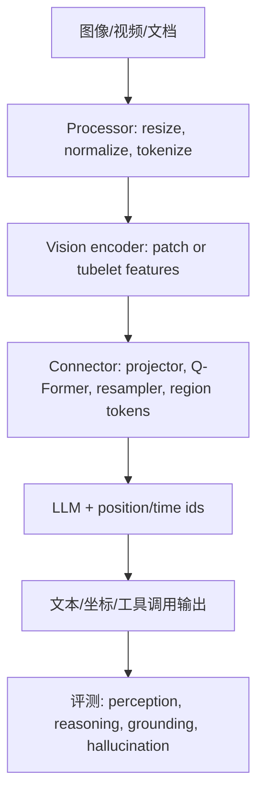
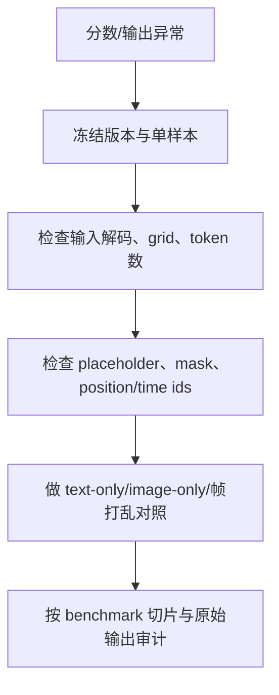

# VLM / 多模态面试深度研究（检索日：2026-08-30）

> 用途：为本项目补充 VLM（vision-language model）/多模态算法、训练、评测、系统与手撕题的 clean-room 研究素材。本文只改写公开资料中的可迁移知识，不复述面经原文、私有题库、雇主内部信息或受版权保护的长段落。
>
> 版本口径：以 2026-08-30 可访问的页面为准。标记“历史”表示奠基工作或当时主流方法；标记“当前”表示截至检索日仍应优先关注的官方实现/论文。模型仓库、API 和 benchmark 会变化；具体分数均应视为论文/模型作者的 self-report，面试回答必须同时说明评测协议、版本和可复现条件。

## 0. 证据等级与使用方式

| 等级 | 来源 | 在面试答案中的用法 |
|---|---|---|
| A | 原论文、官方文档、官方代码仓库、基准官网 | 可作为事实依据；给出链接、版本/章节定位与限制。 |
| B | 官方招聘页/岗位说明 | 仅说明岗位能力频率和工程语境，不证明某道题一定会问。 |
| C | 公开面经/题解/博客 | 只抽取“题型频率信号”；不复制题面、答案、代码或个人经历。 |

回答模板建议按“定义 → 机制/公式 → 工程契约 → 失败模式 → 验证实验 → 追问”展开。若资料之间有版本差异，先说清楚时间点，再给兼容策略。

## 1. 能力地图与时间线

| 阶段 | 代表工作（状态） | 关键思想 | 面试迁移点 |
|---|---|---|---|
| 2017–2021 历史 | ViT（历史）、CLIP（历史） | patch token；图文对比对齐；零样本迁移 | patch/token 数、InfoNCE 温度、负样本与数据噪声。 |
| 2022–2023 历史 | Flamingo、BLIP-2、LLaVA | 固定 latent/查询压缩；冻结视觉/语言塔；轻量 connector；视觉指令微调 | connector 的信息瓶颈、两阶段训练、label mask。 |
| 2023–2024 历史 | Qwen-VL/Qwen2-VL、Video-LLaVA、MMMU/OCRBench/Video-MME | 动态分辨率、统一图像/视频 token、时间位置编码、综合评测 | 视觉 token 预算、帧采样、OCR/grounding 与 benchmark shortcut。 |
| 2024–2025 当前 | Qwen2.5-VL、InternVL3/3.5、LLaVA-NeXT/Video | 原生高分辨率、文档/坐标/绝对时间、偏好优化与测试时扩展 | processor 版本契约、长视频成本、RL 数据和证据对齐。 |
| 2025–2026 当前 | Qwen3-VL 及同代开源栈、MMMU-Pro、OCRBench v2、LongVideoBench 等 | 更长上下文、视觉 agent、interleaved M-RoPE/DeepStack、视觉-only 防捷径 | 版本冻结、视觉 token/视频总预算、跨模态 grounding、可复现实验。 |

### 架构主线



关键不是“把图片拼到 prompt”，而是维护一条可验证的跨模态契约：媒体块顺序、占位符数量、特征序列长度、位置/时间 id、label mask、dtype/device 和预算必须一一对应。

## 2. 核心架构与可推导面试点

### 2.1 ViT patch 与视觉 token 预算

给定图像尺寸 `H×W`、patch size `P`，粗略 patch 数为 `N=(H/P)·(W/P)`；若模型做 2×2 token merge，视觉序列约变为 `N/4`。实际还要计入 CLS、换行/分隔 token、vision start/end 特殊 token，以及动态 resize 的取整规则。视频若有 `T` 个 tubelet/frame 单元，预算可写成 `N_video≈T·N_frame/r²`（`r` 为空间压缩倍率），但不同实现的 temporal stride、window、packing 会改变常数。

面试追问：

1. 为什么不能只按原图像素数估算显存？答：要同时乘以视觉层数/隐藏维、LLM KV cache、batch、帧数和 dtype；processor 的 max/min pixels 还会触发离散网格。
2. 视觉 token 超预算时，优先降低什么？答：先明确任务（OCR/细粒度/全局语义/时间定位），再在短边/长边、帧采样、空间 pooling、分块与摘要之间做消融，不能盲目压缩。
3. 如何检测动态 resize 的 off-by-one？答：记录原图、缩放后 `grid_h/grid_w`、有效 token 数、placeholder 数和最终拼接长度；用奇数尺寸、极小图、超长图做单测。

### 2.2 CLIP：对称 InfoNCE、温度与数据噪声（历史基础，仍是 P0）

图像编码器 `f_I` 与文本编码器 `f_T` 输出归一化向量 `I_i,T_j`。一个 batch 有 `B` 对正样本，令可学习的 logit scale 为 `s=exp(τ)`，相似度矩阵 `L_ij=s·I_i^⊤T_j`。双向损失：

\[
\mathcal L=\tfrac12\left[\operatorname{CE}(L, y)+\operatorname{CE}(L^\top,y)\right],\quad y_i=i.
\]

要点：

- L2 归一化使点积近似 cosine；`τ` 控制分布尖锐度，过大可能导致梯度集中、过小导致区分不足。
- in-batch negatives 便宜但可能含“假负样本”（同类/同图不同 caption）；全局 batch、memory queue 或 hard-negative mining 会改变偏差与通信成本。
- 图文网页对噪声、重复、模板化 alt-text 很敏感；数据去重、语言/版权过滤和 caption 质量比单纯堆 batch 更关键。

SigLIP（历史补充）把全局 softmax 换成逐对 logistic：`y∈{-1,+1}` 时 `-log σ(y(τ·sim+b))`，小 batch/本地 batch 更灵活，但正负采样与 bias 校准成为新问题。

### 2.3 BLIP-2：Q-Former 的信息瓶颈

BLIP-2 冻结图像编码器和 LLM，用少量可学习 query token 的 Q-Former 把视觉特征压成固定长度，再通过线性层接入 LLM。两阶段预训练（视觉-语言表示对齐，再生成式对齐）让可训练参数较少，却引入明显的信息瓶颈。

高频追问：

- query 数量增大为何可能提高 OCR/细节却增加上下文和过拟合风险？因为 query 是固定长度瓶颈，增大容量提高可表达细节，但 LLM 计算、跨注意力和数据需求近似线性上升。
- Q-Former 与普通 MLP projector 的差异？前者用 cross-attention 主动查询视觉 token，能做内容选择；后者只做逐 token/线性映射，简单稳定但压缩与细粒度选择能力有限。

### 2.4 LLaVA：线性 projector + 两阶段视觉指令调优

经典 LLaVA 将 CLIP 视觉特征经可训练线性 projector 映射到 LLM embedding 空间：先用图文/描述数据做 feature alignment，再用 GPT-4 生成的视觉指令数据做 instruction tuning。工程重点在数据配比、对话模板、视觉 token 插入点和只对 assistant 输出计算 loss。

不要把“GPT-4 合成数据”当作质量保证：合成 caption 可能继承视觉误读、语言偏见和模板泄漏；应做人工/规则/模型交叉审计，并报告真实图像、OCR、grounding 和反事实测试。

### 2.5 Qwen-VL 系列：动态分辨率、M-RoPE 与 processor 契约

Qwen2-VL（历史基线）把视觉输入切成动态数量 token，并用 2D-RoPE/M-RoPE 分解时间、高度、宽度轴；图像和视频共享视觉编码路径，视频还需显式采样 fps/时间戳。Qwen2.5-VL 强化文档、坐标、长视频和绝对时间；Qwen3-VL（截至检索日当前）在官方仓库中强调 Interleaved-MRoPE、DeepStack、多语言 OCR、空间/3D 与视觉 agent，具体能力和上下文上限以版本化 checkpoint/配置为准。

一个可落地的 processor 契约（不要假定所有版本字段名相同）：

1. 输入是 typed content blocks（`text`/`image`/`video`），按对话顺序排列。
2. processor 负责 resize/normalize、tokenize、生成 `pixel_values` 或视频张量、`image_grid_thw`/`video_grid_thw`（若该版本提供）及 chat template。
3. collator 将视觉占位符与视觉特征按样本顺序拼接；`input_ids` 中媒体占位符数量必须等于特征序列长度（或显式压缩后的长度）。
4. `labels` 对 user/system 文本、视觉占位符和 padding 设为 `-100`；只在 assistant 目标 token 上计算交叉熵。
5. 训练/推理必须锁定 processor、tokenizer、模型 config、图像后端和 chat template 版本；同一图片仅改变 JPEG 解码或 color space 也可能改变结果。

## 3. 数据、Processor 与训练排障

### 3.1 数据流水线检查表

| 层 | 必查字段 | 常见故障 | 最小验证 |
|---|---|---|---|
| 原始媒体 | MIME、EXIF、色彩空间、尺寸、重复 hash、许可证 | 旋转丢失、灰度/CMYK、坏帧、近重复泄漏 | 统计解码失败率、hash 碰撞与 train/eval 相似度。 |
| 采样/resize | `min_pixels/max_pixels`、短边/长边、fps、帧数、时间戳 | token 爆炸、关键帧遗漏、视频时长错位 | 记录每样本网格、token、帧时间分布；长尾分位数。 |
| 对话模板 | role、content block 类型、媒体占位符 | placeholder 数量不匹配、模板版本漂移 | 构造 text-only/image-only/interleaved 三类 golden case。 |
| labels | assistant span、padding、媒体位置 | user token 泄漏到 loss、全 `-100`、错位监督 | 反解 token span；断言有效 label 数大于 0。 |
| batch/collate | padding side、长度、dtype、device | list/stack 混用、跨设备、梯度断开 | 单样本与 batch=2 对比；开启 anomaly/grad norm。 |
| 评测 | prompt、解码、随机种子、processor、版本 | 分数不可复现、答案格式误判 | 固定 config 并保存原始输出、解析日志与置信区间。 |

### 3.2 数据质量与课程设计

从 DataComp/LLaVA 消融等工作可归纳为：先定义任务覆盖与风险，再做去重、质量分层、难例/反事实配比；“更多 caption”不等于“更好对齐”。建议至少保留四个切片：自然图文、文档/OCR、空间/坐标、视频时序。对每个切片报告训练占比、来源、合成/人工比例和许可证。

VLM SFT 的 label mask 是最容易手撕和排障的桥接点：视觉输入不产生语言 label；仅 assistant 输出计算 CE。若做 grounding/工具调用，可把坐标、时间戳、函数参数作为显式目标，但要定义量化格式、范围（如 `[0,1000)`）和非法值处理。

## 4. 视频与时间建模

### 4.1 采样策略与成本

给定视频时长 `D`、目标 fps `r`、上限帧数 `F_max`，均匀采样可取 `F=min(ceil(D·r),F_max)`；随后按 `video_grid_thw` 或模型约定把帧/temporal tubelet 打包。工程上还要记录实际时间戳，而不是只传帧序号。短动作、镜头切换和字幕出现时间决定采样是否有效。

三类常用策略：

- 均匀/分段采样：低方差、实现简单；可能错过稀有事件。
- 内容/镜头感知采样：用场景切换、运动或 OCR 触发加密；额外预处理成本和偏差。
- Slow/Fast 或分层采样：低 fps 覆盖全局，高 fps 聚焦候选片段；需在 token 上限内联合优化。

### 4.2 时间位置与长视频

M-RoPE/时间 id 要保持与实际采样时间单调对应；重采样后若复用旧 id，会产生“看到了但时间顺序错”的幻觉。长视频还需处理字幕、音频、跨片段检索和上下文截断。LongVideoBench/Video-MME 的设计提示面试官区分：单帧识别、跨帧事件、因果顺序、时间定位、音频/字幕融合，不要把所有错误归为“模型能力不足”。

### 4.3 视频失败模式与诊断

1. **漏检稀有事件**：提高 fps 仍不见目标，检查镜头切分和候选片段召回。
2. **时间倒置**：输出顺序与字幕/帧不一致，检查时间戳单位、排序和 padding。
3. **静态偏置**：模型用单帧物体猜动作，加入打乱帧、反事实动作和 temporal-only 对照。
4. **字幕捷径**：遮蔽字幕后性能骤降，报告字幕可用/不可用两套结果。
5. **token/显存爆炸**：记录 `T×H×W`、压缩倍率、KV cache；使用分层采样、窗口注意力或片段摘要，而不是静默截断。

## 5. OCR、文档、Grounding 与多模态检索

### 5.1 OCR/文档路线

Donut 代表 OCR-free 端到端文档解析，避免“先 OCR 再 VLM”错误传播，但对高分辨率、长文档和结构化输出仍需大量数据与严格 schema。Pix2Struct 通过截图到简化 HTML 的预训练强调布局/渲染关系。DocVQA、ChartQA 与 OCRBench 系列覆盖文本识别、文档问答、关键信息抽取、手写数学和图表推理。

面试要点：

- OCR 文本可作为显式 token，优点是可检索、可审计；缺点是识别错误、版面关系丢失和坐标对齐成本。
- OCR-free 保留视觉版面，端到端更简洁；缺点是高分辨率 token、数据/解码成本高，数值/长文本容易错。
- 真实系统常用级联：低成本 OCR/版面检测召回 + VLM 精读 + 坐标/置信度校验；必须用原图回查关键字段。

### 5.2 Grounding 与坐标

Kosmos-2、Shikra、Ferret、Groma 等工作把区域/坐标作为输出或中间 token。统一接口应明确：坐标参考系（原图、resize 后、归一化）、顺序（`x1,y1,x2,y2`）、闭开区间、越界裁剪、旋转框/多边形是否支持。归一化坐标可以写为 `x'=round(1000·x/W)`、`y'=round(1000·y/H)`，但要在反变换时保留宽高和取整规则。

验证建议：生成框后在原图叠加可视化；用交换宽高、镜像、旋转和空框做 property test；对同一目标要求 IoU、中心点误差和文本正确率分开报告。

### 5.3 视觉文档检索

ColPali/ColQwen2 将页面图像编码成多向量并用 late interaction 检索，减少 OCR/文本抽取损失；VisRAG 直接在页面图像上做检索增强生成。回答检索面试题时要说清楚：向量粒度（page/patch/token）、maxsim 计算、索引内存、页面裁剪、OCR fallback 和引用证据。不要把“图像检索更好”泛化到所有文档；表格、密集文字和跨页问题需按切片评测。

## 6. Hallucination、Groundedness 与偏好对齐

### 6.1 错误分类

| 类型 | 例子（改写） | 诊断问题 |
|---|---|---|
| Object existence | 图中没有狗却回答有狗 | POPE 随机/流行/对抗负样本下的 yes/no。 |
| Attribute | 颜色、数量、文字读错 | 遮蔽背景、替换属性、OCR/检测器交叉核验。 |
| Relation/temporal | 空间关系或先后顺序编造 | grounding 框、帧顺序、关系反事实。 |
| Knowledge | 图像证据不足时补充外部常识 | 证据可见性、检索开关、拒答率。 |
| Language/format | 复述问题、模板化长答、坐标非法 | label mask、schema parser、长度/拒答校准。 |

HallusionBench 区分语言幻觉与视觉错觉；POPE 用不同负样本构造稳定的对象存在性测试；MMHal-Bench/H-POPE 可进一步看事实性、层级属性和关系。评测器若用 LLM judge，必须报告 judge 版本、提示、人工一致性和可能的语言偏好。

### 6.2 缓解手段与 trade-off

1. **数据**：增加 hard negative、反事实图文、拒答/不确定性样本；去除重复和错误 caption。
2. **架构**：引入 region token、OCR/检测器、检索或工具调用；代价是延迟、接口复杂度和错误级联。
3. **训练**：RLHF-V 的片段级纠错、RLAIF-V 的 AI 反馈、多模态 DPO（同时约束视觉偏好）可减少无依据描述；若只优化语言流畅度，可能放大语言捷径。
4. **推理**：要求引用框/时间戳、分步验证、候选生成后再 grounding；要监控过度拒答和延迟。

建议用“事实性 × 有用性 × 拒答率 × 延迟”四维 Pareto，而不是只追一个 hallucination 分数。

## 7. Benchmark 与可复现实验矩阵

| 基准 | 能力/规模（按论文或官网口径） | 典型协议 | 面试陷阱与复现要求 |
|---|---|---|---|
| MMMU / MMMU-Pro | 大学级多学科多模态选择题；MMMU-Pro 过滤可由文本捷径解决的题并加入 vision-only 版本 | 多选准确率；固定选项解析与 CoT 开关 | 原 MMMU 可能被 OCR/选项文字捷径污染；必须报告 text-only、vision-only、选项顺序和解析器。 |
| OCRBench / OCRBench v2 | OCR、场景文字/文档 VQA、KIE、手写数学；v2 扩展双语、多场景、定位 | exact match/任务分数，按任务切片 | 图片预处理、语言、标点归一化会改变分数；保存原始答案和规范化规则。 |
| Video-MME | 900 视频、约 254 小时、2700 人工 QA（历史首版口径），覆盖短至长视频、领域与字幕/音频 | 视频问答准确率；不同时长/模态切片 | fps、最大帧数、字幕可见性、音频解码与上下文长度必须冻结；不要只报总分。 |
| LongVideoBench | 长视频与字幕交错、跨片段指代/推理 | MCQ，按视频时长/跨段难度 | 片段截断和字幕时间戳是主要混杂变量；需保存检索/采样轨迹。 |
| MMBench | 中英多能力选择题、CircularEval | 选项循环与准确率 | 模型可能利用选项格式；固定 prompt、语言和选项排列。 |
| MME | 感知与认知子任务，人工 yes/no 对 | 每个子任务分数/总分 | yes/no 生成解析、图像重复和提示词会影响结果；避免把分数当通用智力。 |
| SEED-Bench/2 | 图像、视频、多维理解选择题 | MCQ；按能力切片 | 版本题集、视频帧和数据许可要注明；不要混用不同版本总分。 |
| MM-Vet | recognition、knowledge、spatial、OCR、math、generation 的组合能力 | GPT/人工综合评分 | 组合题受 judge 偏好影响；报告能力分布和 judge 配置。 |
| MathVista | 视觉数学、细粒度/组合推理，约 6k 例 | 答案准确率、可选 CoT | 计算器/代码执行、单位/数值解析必须固定；区分视觉读取与数学推理。 |
| DocVQA / ChartQA | 文档字段与图表问答 | ANLS/EM 或 chart QA 规范 | OCR、表格结构和数值舍入是主要误差；报告文档类型切片。 |
| POPE / H-POPE / HallusionBench | 对象存在、属性/层级幻觉、语言幻觉与视觉错觉 | yes/no accuracy、precision/recall、judge/人工 | 负样本策略、问题模板、图像分布和 judge 版本不能隐藏。 |

### 最小可复现清单

- 记录 commit、模型/processor/tokenizer revision、权重 hash、CUDA/driver、解码参数、随机种子。
- 记录每张图/每个视频的 resize、`grid_thw`、帧时间戳、token 数、截断/重试原因。
- 固定 system/user 模板、语言、few-shot、选项顺序和答案解析器；把原始生成保存为 artifact。
- 报告总体分数之外的 bootstrap 置信区间、任务/长度/语言/模态切片；若比较模型，先做 paired bootstrap 或 McNemar 检验。
- 用 VLMEvalKit、lmms-eval 或 OpenCompass 等框架时锁定框架 commit，并核对其 processor/解析器是否覆盖目标模型。

## 8. 岗位与公开面经的频率信号（非官方题库）

公开招聘页反复出现“视觉识别/检索、预训练与指令微调、数据管线、OCR/视频、概率与优化、GPU 效率”等关键词；公开面经/博客常见 CLIP InfoNCE、LLaVA 两阶段、Q-Former/projector 对比、动态高分辨率、placeholder/label mask、视频帧采样和幻觉评测。它们只能帮助排序复习优先级，不能替代论文或官方文档，也不应复制原题。

| 频率信号 | A/B 证据锚点 | 建议面试准备 |
|---|---|---|
| 对比学习与视觉-语言对齐 | CLIP、SigLIP 原论文 | 手推双向 loss、温度梯度、假负样本和 batch 通信。 |
| Connector/冻结策略 | BLIP-2、LLaVA、Flamingo | 画数据流；解释信息瓶颈、训练阶段与显存 trade-off。 |
| 动态分辨率/视觉 token | Qwen2-VL/2.5-VL/Qwen3-VL 官方文档 | 给定 `H,W,P,T,max_pixels` 估算 token，并定位 off-by-one。 |
| OCR/文档/坐标 | OCRBench、Pix2Struct、Donut、Ferret | 设计级联、schema、坐标归一化与可视化验证。 |
| 视频与长上下文 | Video-MME、LongVideoBench、LLaVA-Video | 比较均匀、分层、内容感知采样；解释时间 id 与字幕捷径。 |
| 幻觉与偏好 | POPE、HallusionBench、RLHF-V/RLAIF-V/mDPO | 区分错误类型，设计 hard negative、偏好数据和拒答指标。 |
| 评测工程 | MMMU-Pro、VLMEvalKit、lmms-eval | 复现协议、解析器、judge 偏差、置信区间与污染审计。 |

## 9. P0/P1 口述问题库（clean-room 改写）

### P0：基础机制与系统契约

1. 推导 CLIP 对称 InfoNCE；`logit_scale` 初始化、温度过大/过小分别会怎样？
2. in-batch negatives 中出现同语义图片时，梯度如何被污染？给出去重或 soft-label 方案。
3. BLIP-2 Q-Former 为什么是信息瓶颈？query 数、cross-attention 层数与显存如何权衡？
4. LLaVA 的 projector-only 对齐阶段为什么不能直接替代 instruction tuning？两阶段各自监督什么？
5. 比较 MLP projector、Q-Former、Perceiver Resampler、region token connector 的输入输出契约。
6. 给定图像尺寸、patch、压缩倍率和 max token，如何计算预算并处理动态 resize？
7. 解释 `content=[{type:image}, {type:text}]` 如何经过 processor 变成模型输入；如何保证 placeholder 与特征长度一致？
8. 多模态 SFT 的 `labels` 为什么要屏蔽 user、媒体占位符和 padding？如何验证没有 label 泄漏？
9. Qwen2-VL 的 M-RoPE 为什么拆分时间/高/宽轴？图像和视频的 position id 如何兼容？
10. 视觉 encoder 输出 `[B,N,Dv]`、LLM embedding `[B,L,Dm]` 时，projector、packing 和 attention mask 如何设计？
11. OCR-free 与 OCR-augmented 文档系统各自的误差传播、延迟和审计性怎样比较？
12. 坐标输出采用 `[0,1000)` 归一化时，如何定义越界、取整、旋转和原图映射？
13. 视频均匀采样何时会漏掉关键事件？请设计分层采样和预算约束。
14. 帧时间戳、fps、temporal stride 与 M-RoPE 时间 id 不一致时会出现什么症状？
15. POPE 的负样本策略为何会影响结论？如何区分 object hallucination 与视觉错觉？
16. MMMU-Pro 如何降低文本/选项捷径？你会如何做 text-only、vision-only 对照？
17. 设计一套 VLM 评测 artifact schema，使别人能复现一次视频问答结果。
18. 为什么只看平均准确率会掩盖 OCR、长视频或低资源语言退化？至少给出四个切片。

### P1：研究、工程与追问

19. SigLIP 的 pairwise sigmoid loss 与 CLIP softmax 的通信、batch 和校准差异？
20. 视觉 token 压缩从 2×2 merge 改成可学习 pooling，如何做信息保真度消融？
21. 你会怎样构造“同一物体属性改变”的反事实数据来测幻觉？
22. RLHF-V 的片段级纠错与 mDPO 的多模态偏好约束分别解决什么问题？
23. LLM judge 评估 VLM 时有哪些语言偏差？怎样用人工子集和双 judge 做校准？
24. 长视频可采用窗口摘要、检索、分层 token 或更长上下文；如何根据延迟/召回/事实性选型？
25. 视频字幕可用时模型分数上升，如何证明不是字幕捷径而是真正视觉理解？
26. ColPali/ColQwen2 的 late interaction 与单向量 ANN 的索引内存、召回和解释性差异？
27. 图表问答中 OCR、表格结构识别、算术执行各自如何隔离评测？
28. 训练中出现所有 label 为 `-100`、loss=0 或 NaN，按什么顺序排查？
29. 多图对话中第一张图被第二个样本“串图”，如何从 batch 索引和 grid 元数据定位？
30. 如何用 property-based tests 验证镜像/旋转/resize 后坐标和 token 顺序仍然正确？
31. 视觉 token 占满上下文时，如何优先保留 OCR、时间定位和系统指令？
32. 训练数据含相同网页图片的近重复 caption，怎样做跨 split contamination 检测？
33. 要上线一个 VLM OCR 服务，如何设置拒答、低置信度回查、人工复核和 PII 脱敏？
34. 从零实现一个可插拔 multimodal collator，如何支持 text-only、image-only、interleaved image/video？
35. 如何把失败样本自动归因到解码、processor、vision encoder、connector、LLM 或 evaluator？

## 10. 手撕题/编码题规格

每题默认要求：不修改输入；支持 batch；明确 dtype/device；给出时间/空间复杂度；测试正常、空、奇数尺寸、超预算、错位和梯度路径。

### C1. CLIP 双向 InfoNCE（P0）

- 输入：`image_emb[B,D]`、`text_emb[B,D]`、可选 `logit_scale`；输出标量 loss 和 logits。
- 契约：先 L2 normalize；标签为 `arange(B)`；对称 CE；避免手写 `exp` 溢出，约束 scale 范围。
- 测试：`B=1`、重复样本、非 contiguous、float16/bfloat16、梯度非零、与参考实现数值接近。

### C2. 动态视觉 token 预算（P0）

- 输入：`H,W,patch,merge,max_pixels,min_pixels,temporal_frames`；输出取整后的网格和 token 数。
- 契约：明确长边/短边缩放、偶数网格和 cap 触发；超限返回可解释原因，不静默截断。
- 测试：极端长宽比、奇数尺寸、`max_pixels<min_pixels`、视频帧上限和确定性。

### C3. 多模态 collator 与 label mask（P0）

- 输入：typed messages、媒体特征列表、tokenizer/template；输出 padded `input_ids/attention_mask/labels` 和媒体索引。
- 契约：逐样本验证 placeholder=feature 长度；assistant-only loss；padding side 可配置；不跨样本共享 tensor。
- 测试：text-only、两图、一图一视频、空 assistant、错配应抛出带样本 id 的异常。

### C4. M-RoPE/时间位置 id（P0）

- 输入：每个视觉 token 的 `(t,h,w)` 网格、文本长度、媒体顺序；输出三轴 position ids。
- 契约：时间戳单调；文本 token 使用约定轴；padding 不参与；多媒体序列不重叠或按版本规则偏移。
- 测试：图像 `t=1`、视频变 fps、交错图文、截断后重算、镜像不改变时间轴。

### C5. 视频分层采样器（P1）

- 输入：总帧数/时长、fps、候选镜头或运动分数、`F_max`；输出有序去重帧索引与时间戳。
- 契约：至少保留首尾/每段代表帧；预算严格；随机策略可由 seed 复现。
- 测试：短视频、空镜头、突发事件、时间戳缺失、`F_max=0/1`。

### C6. 坐标归一化与反变换（P1）

- 输入：原图尺寸、resize/letterbox 参数、框/点；输出模型坐标与原图坐标。
- 契约：声明 xyxy/xywh、闭开区间、round/clamp；非法框可拒绝或修复但不能静默。
- 测试：镜像、旋转、非等比 resize、边界框、空框和 round-trip 误差。

### C7. POPE 风格存在性评估器（P1）

- 输入：问题/金标、模型自由文本、正则化规则；输出 TP/FP/FN/TN、precision/recall/F1 与拒答率。
- 契约：yes/no 同义词、否定句、无法判断单独归类；保留原始输出供审计。
- 测试：大小写/标点、含双重否定、冗余解释、非法答案；与手工 confusion matrix 对照。

### C8. Late-interaction 视觉文档检索（P1）

- 输入：query token `[Q,D]`、页面 token `[P,D]`；输出 max-sim 聚合分数及 top-k。
- 契约：向量归一化/掩码、分块索引、内存上限、稳定 tie-break；可返回贡献 patch 以便解释。
- 测试：空 query/page、重复页面、不同 token 数、CPU/GPU 一致性和 top-k 稳定性。

## 11. 排障与实验设计 Playbook

### 11.1 从症状到最小复现



优先做单样本、batch=2、CPU reference 三个对照；再扩展到分布式/量化/缓存。每次只改一个变量，并把 token 数、显存、延迟和错误类别一起记录。

### 11.2 常见症状诊断表

| 症状 | 首查项 | 进一步实验 |
|---|---|---|
| 输出全是“看不清/不知道” | 图像是否被错误归一化、placeholder 是否被 mask | 纯文本/纯图、原图可视化、不同 processor 版本。 |
| OCR 数字错一位 | 分辨率/patch 压缩、JPEG、语言 tokenizer | 原图 vs 2× crop、OCR baseline、字符级 exact match。 |
| 视频回答像单帧分类 | 帧数、时间 id、帧顺序 | 打乱帧、只给首尾、提高候选片段 fps。 |
| loss=0 或 NaN | label 有效数、scale、混合精度 | 打印 label histogram、禁用 AMP、梯度裁剪/scale clamp。 |
| 多图串图 | collator 媒体索引、padding/packing | batch=1→2、媒体顺序置换、每样本 hash 日志。 |
| benchmark 高但线上差 | 数据污染、选项/字幕捷径、解析器 | vision-only、去字幕、反事实和时间切片。 |

### 11.3 一页实验计划模板

1. **假设**：例如“高分辨率提升 OCR，但 token 成本使长视频退化”。
2. **变量**：固定模型/数据/解码，只改变 `max_pixels` 或 fps。
3. **切片**：短/长边、文字密度、视频时长、语言、字幕开关。
4. **指标**：任务准确率、字符/框级指标、幻觉 precision/recall、token、显存、延迟、拒答率。
5. **停止条件**：预注册主要指标与最小效应；失败也保存配置和原始输出。

## 12. 可直接落 YAML 的卡片规格（建议新增）

下面的 `source_ids` 中，带 `proposed-` 的 ID 是本文建议在统一 source registry 中登记的别名；落库前请由维护者核对 URL、许可证和当前 revision。字段名按项目现有卡片风格给出，`core_formula` 与 `followups` 可直接拆成题面/追问字段。

```yaml
- id: EGT-VLM-005
  title: "视觉 token 预算与动态分辨率"
  domain: multimodal
  tracks: [algorithm, systems]
  skills: [vision-token-budget, processor-contract, complexity-analysis, debugging]
  priority: P0
  source_ids: [proposed-qwen25-vl-paper, proposed-qwen3-vl-repo, hf-multimodal-chat]
  related_problems: [C2, C3]
  core_formula: "N_image≈ceil(H/P)·ceil(W/P)/r²; N_video≈T·N_image; enforce N≤budget"
  prompt: "给定 H,W,P、空间压缩 r、视频帧 T 与 max_pixels，估算 token、显存和延迟，并设计超预算策略。"
  followups:
    - "奇数尺寸、letterbox、2x2 merge 后 placeholder 数如何验证？"
    - "OCR、细粒度分类、长视频分别优先牺牲哪一维？"
    - "如何记录 processor/config revision 以便复现？"

- id: EGT-VLM-006
  title: "M-RoPE 与视频时间建模"
  domain: multimodal
  tracks: [algorithm, systems]
  skills: [positional-encoding, temporal-sampling, tensor-shapes, ablation-design]
  priority: P0
  source_ids: [proposed-qwen2-vl-paper, proposed-qwen25-vl-paper, proposed-videomme-paper, proposed-longvideobench-paper]
  related_problems: [C4, C5]
  core_formula: "pos_i=(t_i,h_i,w_i); t_i由真实采样时间/temporal stride单调生成，padding不参与"
  prompt: "设计图像/视频交错输入的三轴位置 id 与分层采样器，说明 fps、时间戳和 token cap 的耦合。"
  followups:
    - "打乱帧后分数仍高，如何证明模型使用了视觉时间证据？"
    - "字幕与视觉冲突时如何做 modality ablation？"
    - "长视频窗口摘要和检索各自的召回/延迟代价？"

- id: EGT-VLM-007
  title: "OCR/文档解析与视觉 grounding"
  domain: multimodal
  tracks: [algorithm, applications]
  skills: [ocr, document-understanding, coordinate-normalization, schema-validation]
  priority: P0
  source_ids: [ocrbench-benchmark, proposed-ocrbench-v2-paper, proposed-pix2struct-paper, proposed-donut-paper, proposed-ferret-paper]
  related_problems: [C6]
  core_formula: "x'=round(1000·x/W), y'=round(1000·y/H); IoU与字符/字段准确率分开报告"
  prompt: "比较 OCR-augmented、OCR-free 与级联文档系统；定义坐标、schema、越界和回查策略。"
  followups:
    - "高分辨率切片如何避免跨块重复与阅读顺序错位？"
    - "表格/图表中的结构错误如何与 OCR 字符错误隔离？"
    - "如何可视化并审计一个错误框？"

- id: EGT-VLM-008
  title: "多模态 hallucination 评测与缓解"
  domain: multimodal
  tracks: [algorithm, evaluation]
  skills: [hallucination-taxonomy, benchmark-protocol, preference-alignment, uncertainty]
  priority: P0
  source_ids: [proposed-pope-paper, proposed-hallusion-paper, proposed-mmhal-paper, proposed-rlhf-v-paper, proposed-rlaif-v-paper, proposed-mdpo-paper]
  related_problems: [C7]
  core_formula: "precision=TP/(TP+FP), recall=TP/(TP+FN), F1=2PR/(P+R); 另报拒答率与延迟"
  prompt: "区分 object/attribute/relation/knowledge hallucination，选择 POPE/Hallusion/MMHal 等协议并设计干预。"
  followups:
    - "只优化流畅度为何会放大视觉幻觉？"
    - "LLM judge 偏差如何用人工子集、双 judge 和置信区间校准？"
    - "偏好对齐怎样防止过度拒答？"

- id: EGT-VLM-009
  title: "MMMU-Pro/OCRBench/Video-MME 的可复现评测"
  domain: multimodal
  tracks: [evaluation, systems]
  skills: [benchmark-reproduction, contamination-audit, statistical-testing, data-slicing]
  priority: P0
  source_ids: [mmmu-benchmark, proposed-mmmu-pro-paper, ocrbench-benchmark, proposed-videomme-paper, proposed-vlmevalkit-repo, proposed-lmms-eval-paper]
  related_problems: []
  core_formula: "paired bootstrap CI；按模态/长度/语言/任务切片，固定 prompt、解析器、seed 与 revision"
  prompt: "制定一份从权重到原始输出可复现的 VLM benchmark protocol，并识别文本/字幕/选项捷径。"
  followups:
    - "MMMU-Pro 的 vision-only 与原 MMMU 分数差异如何解释？"
    - "视频 fps、字幕、音频、最大帧数缺失时能否比较？"
    - "如何做 contamination 与 evaluator bias 审计？"

- id: COD-VLM-003
  title: "多模态 collator、placeholder 与 label mask"
  domain: multimodal
  tracks: [coding, systems]
  skills: [pytorch, batching, masking, shape-invariants, numerical-stability]
  priority: P0
  source_ids: [hf-multimodal-chat, proposed-qwen25-vl-paper, llava-paper]
  related_problems: [C3, C4]
  core_formula: "L=CE(logits[assistant_mask], labels[assistant_mask]); media/padding/user labels=-100"
  prompt: "实现支持 text-only、image-only、interleaved image/video 的 collator；错误时报告 sample id 与媒体索引。"
  followups:
    - "placeholder 与视觉特征长度不一致如何 fail fast？"
    - "padding side、非 contiguous tensor、混合精度怎样测试？"
    - "为何全 -100 会导致 loss=0，如何在训练前阻断？"
```

## 13. 来源审计（检索日均为 2026-08-30）

定位字段尽量指向摘要、官方文档章节、仓库 README 或 benchmark 主页；无法稳定抽取的动态招聘页仅作为 B 级频率信号。所有“clean-room 改写”均为本文作者的概念重述，不是原文摘录。

| source_id | URL（官方/论文优先） | 版本/定位 | 可信度 | clean-room 改写与建议 |
|---|---|---|---|---|
| clip-paper | [CLIP paper](https://arxiv.org/abs/2103.00020) | 2021，摘要/方法 | A | 图文对比预训练、零样本迁移；支撑 InfoNCE 卡。 |
| blip2-paper | [BLIP-2](https://arxiv.org/abs/2301.12597) | 2023，摘要/HTML §3 | A | 冻结双塔 + Q-Former + 两阶段对齐；支撑 connector 卡。 |
| llava-paper | [LLaVA](https://arxiv.org/abs/2304.08485) | 2023，摘要/HTML §3–4 | A | 视觉 projector、视觉指令数据、两阶段训练；支撑 collator/SFT 卡。 |
| hf-multimodal-chat | [HF multimodal chat templates](https://huggingface.co/docs/transformers/chat_templating_multimodal) | 持续更新，content blocks/Processor | A | typed media → processor → tensors/template；支撑输入契约卡。 |
| proposed-qwen2-vl-paper | [Qwen2-VL](https://arxiv.org/html/2409.12191) | 2024，HTML 摘要/§2–4 | A | 动态分辨率、2D/M-RoPE、图像视频统一训练；支撑 token/时间卡。 |
| proposed-qwen25-vl-paper | [Qwen2.5-VL](https://arxiv.org/abs/2502.13923) | 2025，摘要 | A | 文档、grounding、绝对时间、长视频能力；支撑 OCR/时间卡。 |
| proposed-qwen3-vl-repo | [Qwen3-VL official repo](https://github.com/QwenLM/Qwen3-VL) | 截至 2026-08-30，README/模型说明 | A | Interleaved-MRoPE、DeepStack、视觉 agent 与 token budget；版本敏感。 |
| proposed-internvl3-paper | [InternVL3](https://arxiv.org/abs/2504.10479) | 2025，摘要 | A | 原生多模态预训练、V2PE、SFT/MPO；用于比较训练路线。 |
| proposed-internvl35-paper | [InternVL3.5](https://arxiv.org/abs/2508.18265) | 2025，摘要 | A | offline/online Cascade RL、resolution router、部署解耦；数字为 self-report。 |
| proposed-siglip-paper | [SigLIP](https://arxiv.org/abs/2303.15343) | 2023，摘要/方法 | A | pairwise sigmoid 替代全局 softmax；支撑对比学习追问。 |
| proposed-flamingo-paper | [Flamingo](https://arxiv.org/abs/2204.14198) | 2022，摘要 | A | Perceiver Resampler + gated cross-attention；支撑 connector 对比。 |
| proposed-videollava-paper | [Video-LLaVA](https://arxiv.org/abs/2311.10122) | 2023，摘要 | A | 图像/视频共享表示并在 projection 前对齐；支撑视频路线。 |
| proposed-llava-video-blog | [LLaVA-Video](https://llava-vl.github.io/blog/2024-09-30-llava-video/) | 2024，官方博客 | A | 1 fps caption、问题类型、多尺度时空表示；数据量需按版本核对。 |
| proposed-videomme-paper | [Video-MME](https://arxiv.org/abs/2405.21075) | 2024，摘要/官网 | A | 长短视频、人类 QA、领域/字幕/音频切片；支撑评测卡。 |
| proposed-longvideobench-paper | [LongVideoBench](https://arxiv.org/abs/2407.15754) | 2024，摘要/项目页 | A | 长视频+字幕交错与跨段指代；支撑 temporal 卡。 |
| mmmu-benchmark | [MMMU project](https://mmmu-benchmark.github.io/) | 2023+，官网/论文 | A | 大学级多学科多模态题；支撑 benchmark 卡。 |
| proposed-mmmu-pro-paper | [MMMU-Pro](https://arxiv.org/abs/2409.02813) | 2024，摘要/HTML | A | vision-only、去文本捷径、选项增强；支撑可复现评测卡。 |
| ocrbench-benchmark | [OCRBench repo](https://github.com/yuliang-liu/multimodalocr) | 2023，README/论文 | A | OCR、scene/document VQA、KIE、手写数学；支撑 OCR 卡。 |
| proposed-ocrbench-v2-paper | [OCRBench v2](https://arxiv.org/abs/2501.00321) | 2025，摘要/HTML | A | 双语、多场景、定位和逻辑推理；版本需冻结。 |
| proposed-mmbench-paper | [MMBench](https://arxiv.org/abs/2307.06281) | 2023，摘要/官方 repo | A | 双语能力选择题与 CircularEval；支撑解析器审计。 |
| proposed-mme-paper | [MME](https://arxiv.org/abs/2306.13394) | 2023，摘要 | A | 感知/认知 yes-no 子任务；支撑协议对照。 |
| proposed-seed-bench | [SEED-Bench](https://arxiv.org/abs/2307.16125) | 2023，论文/repo | A | 图像/视频多能力 MCQ；区分版本题集。 |
| proposed-mmvet-paper | [MM-Vet](https://arxiv.org/html/2308.02490v4) | 2023，HTML/repo | A | 六种组合能力与 judge 评分；支撑综合评测追问。 |
| proposed-mathvista-paper | [MathVista](https://arxiv.org/abs/2310.02255) | 2023，论文/项目页 | A | 视觉数学细粒度/组合推理；支撑工具与解析器测试。 |
| proposed-pope-paper | [POPE](https://arxiv.org/abs/2305.10355) | 2023，摘要/repo | A | 随机/流行/对抗负样本测对象幻觉；支撑 hallucination 卡。 |
| proposed-hallusion-paper | [HallusionBench](https://arxiv.org/abs/2310.14566) | 2023，摘要 | A | 语言幻觉与视觉错觉拆分；支撑错误分类。 |
| proposed-mmhal-paper | [MMHal-Bench source paper](https://arxiv.org/html/2309.14525v1) | 2023，HTML | A | 人工 VQA + judge 事实性；需报告 judge 偏差。 |
| proposed-ferret-paper | [Ferret](https://arxiv.org/abs/2310.07704) | 2023，论文/Apple repo | A | 区域连续特征 + 离散坐标、空间采样；支撑 grounding 卡。 |
| proposed-pix2struct-paper | [Pix2Struct](https://arxiv.org/abs/2210.03347) | 2022，摘要/HTML | A | screenshot-to-HTML 与可变分辨率；支撑文档路线。 |
| proposed-donut-paper | [Donut](https://arxiv.org/abs/2111.15664) | 2022，论文/repo | A | OCR-free 端到端文档解析；支撑 OCR trade-off。 |
| proposed-docvqa-paper | [DocVQA](https://arxiv.org/abs/2007.00398) | 2020，论文/官网 | A | 文档问答字段级评测；支撑文档切片。 |
| proposed-chartqa-paper | [ChartQA](https://arxiv.org/abs/2203.10244) | 2022，论文/repo | A | 图表问答与数值推理；支撑结构/算术拆分。 |
| proposed-colpali-paper | [ColPali](https://arxiv.org/abs/2407.01449) | 2024，论文/repo | A | 页面多向量 + late interaction；支撑视觉检索卡。 |
| proposed-visrag-paper | [VisRAG](https://arxiv.org/abs/2410.10594) | 2024，论文/repo | A | 页面图像检索增强生成；支撑 OCR fallback 讨论。 |
| proposed-rlhf-v-paper | [RLHF-V](https://arxiv.org/html/2312.00849v2) | 2023，HTML/repo | A | 片段级纠错偏好；数字与收益按论文版本核对。 |
| proposed-rlaif-v-paper | [RLAIF-V](https://arxiv.org/html/2405.17220v3) | 2024，HTML/repo | A | AI feedback 与推理时扩展；self-report，注意 judge。 |
| proposed-mdpo-paper | [mDPO](https://arxiv.org/abs/2406.11839) | 2024，摘要 | A | 同时建模图像偏好，减轻语言-only 偏好；支撑对齐卡。 |
| proposed-vlmevalkit-repo | [VLMEvalKit](https://github.com/open-compass/VLMEvalKit) | 持续更新，README | A | 多模型/多 benchmark harness；需锁 commit。 |
| proposed-lmms-eval-paper | [lmms-eval](https://arxiv.org/html/2407.12772v2) | 2024，HTML/repo | A | 统一图像/视频/音频评测与复现；需锁任务版本。 |
| proposed-bytedance-vlm-signal | [公开岗位/面经信号](https://www.nowcoder.com/feed/main/detail/92feb9e1194c4019bdca852a21849101?toCommentId=22835573) | 2025–2026，候选人公开帖 | C | 仅抽取“对比学习、tokenizer、视频/OCR、MoE/RL”频率，不作为事实依据。 |
| proposed-csdn-vlm-signal | [公开面经汇总](https://blog.csdn.net/m0_51940505/article/details/160920013) | 2025，博客 | C | 仅抽取 CLIP/LLaVA/OCR 题型频率；不复制题面或答案。 |

### 版本与链接维护提示

- 论文 arXiv 页面可能有多个 revision；引用时写明 `vN` 或检索日期，避免把后续修订当成原始结论。
- 官方模型卡的 benchmark 数字不是独立复核结果，统一加“self-report”标签，并优先给出基准官方协议。
- 动态招聘页和面经页面可能下线、改版或带付费/版权限制；只保留 URL、题型标签和证据等级，定期做链接检查。
